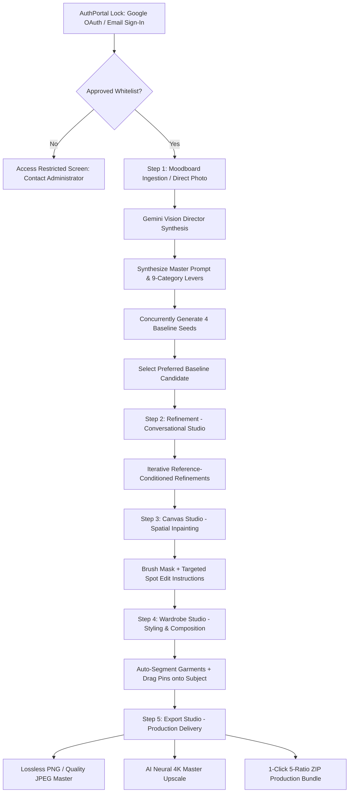

# Product Requirements Document (PRD)
## Fashion AI Studio (Image Gen Pipeline)

**Document Version**: 7.0  
**Status**: Active / Production Cloud-Native Studio  
**Last Updated**: 2026-09-01  

---

## 1. Product Overview & Vision

**Fashion AI Studio** is an enterprise-grade, deterministic creative studio and production pipeline designed for fashion art directors, visual artists, and creative teams. It transforms moodboard imagery and artistic intent into reproducible, high-fidelity visual assets powered by Google GenAI multimodal models (`gemini-3.5-flash-lite`, `gemini-3.7-flash`, `gemini-3.1-flash-image`, `gemini-3-pro-image`).

The studio is locked behind an exclusive, **Invite-Only Luxury Authentication Portal** and operates across a **5-Step Sequential Workflow**:

```
                 [Exclusive AuthPortal Gate & Whitelist Security]
                                        │
                                        ▼
[Uploaded Moodboard (1–5) / Direct Photo] + [User Creative Intent]
                                        │
                                        ▼
   ┌─────────────────────────────────────────────────────────────┐
   │ Step 1: Art Direction (Vision Director & Baselines)         │
   │ • Vision Director synthesizes Master Prompt & Levers        │
   │ • Concurrently renders 4 Baseline Seeds across ratios       │
   │ • Option to skip via Direct Photo Ingestion                 │
   └─────────────────────────────────────────────────────────────┘
                                        │
                                        ▼
   ┌─────────────────────────────────────────────────────────────┐
   │ Step 2: Refinement (Conversation Studio)                    │
   │ • Conversational natural-language prompts                   │
   │ • Reference image conditioning + Seed lock                  │
   │ • Multi-turn thread history with visual thumbnail timeline  │
   └─────────────────────────────────────────────────────────────┘
                                        │
                                        ▼
   ┌─────────────────────────────────────────────────────────────┐
   │ Step 3: Canvas Studio (Micro Spatial Inpainting)            │
   │ • Interactive brush masking on full canvas                  │
   │ • Natural language localized spot editing                   │
   │ • Seamless boundary-preserving generative diffusion         │
   └─────────────────────────────────────────────────────────────┘
                                        │
                                        ▼
   ┌─────────────────────────────────────────────────────────────┐
   │ Step 4: Wardrobe Studio (Multi-Garment Styling & Pins)      │
   │ • Sheet/lookbook auto-detection & segmentation into cards   │
   │ • Drag-and-drop numbered pin placement (①, ②, ③) on subject │
   │ • Multi-image composition conditioning simultaneously       │
   └─────────────────────────────────────────────────────────────┘
                                        │
                                        ▼
   ┌─────────────────────────────────────────────────────────────┐
   │ Step 5: Export Studio (Production Delivery & 4K Master)     │
   │ • Lossless PNG / Configurable JPEG single-image download    │
   │ • AI-powered neural 4K master restoration & upscale         │
   │ • 1-Click 5-Ratio ZIP Production Bundle with metadata       │
   └─────────────────────────────────────────────────────────────┘
```

---

## 2. Problem Statement & Core Value Proposition

### 2.1 Problem Statement
- **Iterative Edit Degradation**: Chaining edits in typical image generators re-compresses assets with lossy chroma subsampling ($\text{YUV 4:2:0}$), causing chromatic degradation and severe color shifts across iterations.
- **Unstructured Prompt Drift**: Editing isolated details (e.g., lighting or clothing) often mutates character facial identity, composition, and physical environment unintentionally.
- **Fragmented Tooling**: Creators waste significant time bouncing between disparate tools for moodboard analysis, prompt engineering, multi-seed exploration, localized inpainting, multi-garment styling, and production ratio export.
- **Enterprise Collaboration & Access Control**: Creative studios require strict whitelist access control, per-member compute budget tracking, and centralized team administration.

### 2.2 Core Value Proposition
- **5-Step Unified Creative Pipeline**: Seamless transition from Art Direction → Refinement → Canvas → Wardrobe → Export.
- **Full-Screen Luxury AuthPortal & Whitelist Gate**: App is completely locked behind an invite-only authentication gate with in-app Admin management.
- **Chroma & Color Constancy Preservation**: Lossless PNG/WebP multi-turn conditioning, ICC profile preservation, and white balance locks eliminate color drift.
- **Surgical Spatial Inpainting & Interactive Pinning**: Macro conversational refinement, micro canvas brush masking, and visual garment pin-dropping on subjects.
- **Cloud-Native Scalability & Multi-Tenancy**: Built on Google Cloud Run, Cloud Storage, Cloud Firestore, and Firebase Authentication with secure user data isolation.
- **Global CDN Edge Delivery**: Firebase Hosting CDN edge routing for ultra-low latency asset delivery and zero-CORS API proxying.
- **Cost & Token Transparency**: Real-time token and USD cost estimation per operation, per user, and accumulated across lineage chains.

---

## 3. Live Production Endpoints

- **Web Application (Global CDN)**: `https://ai-art-director-prod.web.app`
- **Backend Service (Cloud Run)**: `https://fashion-art-director-1012864945903.asia-southeast1.run.app`
- **Observability Dashboard**: `https://ai-art-director-prod.web.app/observability`
- **Health Check**: `https://ai-art-director-prod.web.app/health`

---

## 4. End-to-End User Journey



### Access Gate: Authentication & Whitelist Verification
1. User arrives at the Studio app and is presented with the full-screen Haute Couture **AuthPortal**.
2. User authenticates via single-click Google OAuth or Email/Password.
3. If user email is approved or matches `ADMIN_EMAILS`, the full Studio workspace unlocks. If not on the whitelist, the user sees an **Access Restricted** screen with approval status polling.

### Step 1: Art Direction (Moodboard Ingestion & Baseline Sweep)
1. User uploads 1 to 5 moodboard files (PNG, JPEG, WebP, PDF) and enters a creative prompt (or uploads a direct photo to skip analysis).
2. AI Vision Director (`gemini-3.5-flash-lite` or `gemini-3.7-flash`) analyzes references, synthesizes a 4-phase structured **Master Prompt**, extracts **Scene Narrative**, and populates **9-Category Visual Levers**.
3. The system scans for prompt contradictions and renders 4 concurrent baseline image candidates (`gemini-3.1-flash-lite-image`, `gemini-3.1-flash-image`, or `gemini-3-pro-image`).

### Step 2: Refinement (Conversational Studio)
1. User selects a baseline anchor and enters natural-language refinement instructions (e.g., *"Make lighting golden hour"*, *"Change background to minimalist concrete studio"*).
2. Engine renders iterations using reference image conditioning and locked seeds to maintain subject identity and structure.
3. Every refinement is tracked in an interactive conversation thread timeline.

### Step 3: Canvas Studio (Micro Spatial Inpainting)
1. User paints a binary mask (`#FFFFFF` edit, `#000000` preserve) over target areas with adjustable brush size and undo/redo.
2. User provides a focused instruction (e.g., *"Replace watch with a silver vintage chronometer"*).
3. The inpainting engine modifies only masked pixels while harmonizing boundaries and lighting.

### Step 4: Wardrobe Studio (Garment Extraction & Multi-Pin Styling)
1. User uploads a lookbook or multi-garment sheet. Gemini Vision auto-detects bounding boxes and extracts categorized garment cards.
2. User drags garment cards onto the master image, dropping numbered pins (①, ②, ③) on the subject.
3. Multi-image composition dispatches parent image + garment references simultaneously with anatomical grounding prompts.

### Step 5: Export Studio (Production Delivery & 4K Master)
1. Single-image export in lossless PNG or compressed JPEG (75%–100% quality slider).
2. 1-click AI-powered neural master upscale / restoration for crisp fabric weaves and facial fidelity.
3. 1-click download of the 5-ratio production ZIP bundle (`4:5`, `9:16`, `1.85:1`, `1:1`, `1.8:1`) with JSON lineage metadata.

---

## 5. Functional Requirements

### 5.1 Step 1: Art Direction & Baseline Synthesis
- **FR-1.1 Multi-Format Ingestion**: Ingest 1 to 5 files (PNG, JPEG, WebP, PDF) with drag-and-drop.
- **FR-1.2 Direct Photo Ingestion**: Direct single-image upload bypassing moodboard analysis with automatic aspect ratio detection.
- **FR-1.3 Master Prompt & Lever Extraction**: Synthesize 4-phase Master Prompt, scene logline, and 9-category visual tag chips.
- **FR-1.4 Bi-Directional Re-Sync**: Synchronize Master Prompt from visual levers, or deconstruct Master Prompt back into visual levers.
- **FR-1.5 Conflict Detection**: Identify conflicting lighting, color, or stylistic directives with severity and recommendations.
- **FR-1.6 Parallel 4-Baseline Generation**: Concurrently render 4 candidate images across distinct seeds.

### 5.2 Step 2: Refinement Studio
- **FR-2.1 Reference-Conditioned Refinement**: Natural-language prompts conditioned on parent image bytes.
- **FR-2.2 Seed-Locking & Continuity**: Maintain seed across turns to preserve anatomical and stylistic consistency.
- **FR-2.3 Conversation Thread Timeline**: Chronological message timeline with thumbnails, seeds, and click-to-load navigation.

### 5.3 Step 3: Canvas Studio (Inpainting)
- **FR-3.1 Interactive Masking**: Full-bleed drawing canvas with customizable brush size, cursor indicator, and Undo/Redo.
- **FR-3.2 Boundary-Preserving Inpainting**: Generates target edits strictly within masked pixels while harmonizing lighting transitions.

### 5.4 Step 4: Wardrobe Studio & Composition
- **FR-4.1 Sheet Auto-Segmentation**: Detect garments from multi-item lookbooks, extract normalized bounding boxes, and save cropped cards.
- **FR-4.2 Drag-and-Drop Pinning**: Position numbered pins (①, ②, ③) on the subject viewport with coordinate tracking.
- **FR-4.3 Multi-Image Composition**: Condition simultaneously on parent master and multiple garment image references in a single API call.
- **FR-4.4 Garment Library Management**: Persistent item storage, metadata inspection, and soft deletion.

### 5.5 Step 5: Export Studio & Production Delivery
- **FR-5.1 Formats & Presets**: Download single master (PNG / JPEG) and 5-ratio ZIP bundle (`4:5`, `9:16`, `1.85:1`, `1:1`, `1.8:1`).
- **FR-5.2 AI Neural Master Upscale**: 4K texture and weave restoration via neural upscale pipeline.
- **FR-5.3 Metadata Bundle**: Embed full generation lineage, seed, prompt, and token cost JSON in export archives.

### 5.6 Security, Authentication & Whitelist Management
- **FR-6.1 Dedicated Full-Screen AuthPortal**: Luxury editorial lock screen completely securing the application against unauthenticated or unapproved visitors.
- **FR-6.2 Invite-Only Whitelist Authorization**: Non-whitelisted visitors are rejected with an Access Restricted screen; initial admins configured via `ADMIN_EMAILS`.
- **FR-6.3 In-App Admin Management Portal**: Modal interface for administrators to pre-authorize member emails, assign roles (`admin` vs `user`), toggle account statuses (`approved`, `disabled`), and monitor compute spend.
- **FR-6.4 Local Dev Quick Access**: One-click local administrator bypass for offline testing when `ENVIRONMENT=local`.
- **FR-6.5 Observability & Telemetry**: Dedicated `/telemetry` dashboard with live audit logs, request lifecycle tracing, Firestore collection inspector, and latency/cost metrics.
- **FR-6.6 Lineage History & Split-Slider Diff**: History drawer tracking generation ancestry with side-by-side visual split-slider comparison.
- **FR-6.7 Dynamic Model Switching**: Runtime selection between vision models (`gemini-3.5-flash-lite`, `gemini-3.7-flash`) and image models (`gemini-3.1-flash-lite-image`, `gemini-3.1-flash-image`, `gemini-3-pro-image`).

---

## 6. Technical Stack & Cloud Architecture

- **Compute & Deployment**: Google Cloud Run (Serverless container, multi-stage Docker build, Python 3.11 + `uv`).
- **Edge CDN & Hosting**: Firebase Hosting with unified same-origin routing to Cloud Run.
- **Database**: Google Cloud Firestore (Native mode, 8 flat collections: `users`, `moodboards`, `generations`, `conversations`, `wardrobe_items`, `composition_assignments`, `telemetry_events`, `usage_daily`).
- **Blob Storage**: Google Cloud Storage (`gs://ai-art-director-prod-store`) with HTTP 307 signed URL redirection.
- **Authentication & Security**: Firebase Authentication with JWT Bearer validation and Firestore user whitelist enforcement.
- **Secrets Management**: Google Secret Manager (`GEMINI_API_KEY`).
- **AI Framework**: Google GenAI SDK (`google-genai`) with Interactions API (`client.interactions.create`).
- **Frontend**: React 18+ with Vite, Lucide React icons, and modern dark Vanilla CSS.
- **CI/CD**: GitHub Actions with Workload Identity Federation (WIF).

---

## 7. Non-Functional Requirements (NFRs)

- **NFR-1 Color & Chroma Constancy**: Reference images encoded in lossless PNG/WebP with ICC profile preservation to eliminate multi-turn degradation.
- **NFR-2 Latency & Concurrency**: 4-baseline generation dispatches concurrently for minimal turnaround (~300ms average edge latency).
- **NFR-3 Enterprise Security**: Invite-only whitelist, Secret Manager key retrieval, keyless CI/CD, uniform bucket access, and least-privilege IAM service accounts.
- **NFR-4 UI Fluidity**: 60 FPS canvas painting, drag-and-drop pin tracking, and responsive split-slider comparison.
- **NFR-5 High Availability**: Serverless auto-scaling (0–5 instances) with zero idle compute cost.
