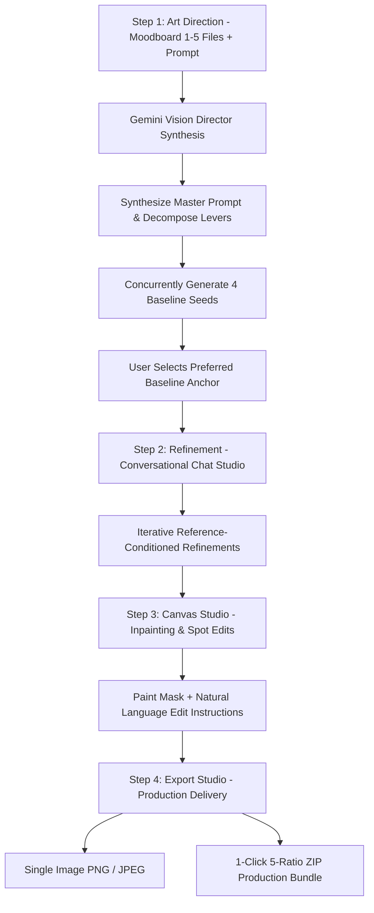

# Product Requirements Document (PRD)
## Image Gen Pipeline Studio

**Document Version**: 4.0  
**Status**: Active / 4-Step Sequential Studio Release  
**Last Updated**: 2026-08-25  

---

## 1. Product Overview & Vision

**Image Gen Pipeline Studio** is a self-contained, local creative studio and pipeline that transforms moodboard imagery and creative intent into deterministic, reproducible, and fine-grain controllable image generation workflows.

The application implements a **4-Step Sequential Workflow**:
1. **Art Direction (Step 1)**: Multimodal moodboard ingestion (1–5 files) + creative prompt, synthesized by AI Vision Director into an optimal Master Prompt and 4 exploratory baseline seeds.
2. **Refinement (Step 2)**: Natural-language conversation-based prompting where each refinement conditions on the active output reference with seed-locking and thread history tracking.
3. **Canvas Studio (Step 3)**: Surgical spatial inpainting using interactive brush masking (`#FFFFFF` / `#000000`), natural language edit instructions, and boundary-blending generative diffusion.
4. **Export (Step 4)**: Dedicated export studio offering single-image lossless PNG / compressed JPEG downloads and 1-click 5-ratio production bundles (`4:5`, `9:16`, `1.85:1`, `1:1`, `1.8:1`) with JSON metadata.

```
[Uploaded Moodboard (1–5)] + [User Creative Intent]
                      │
                      ▼
   ┌──────────────────────────────────────────────┐
   │ Step 1: Art Direction                        │
   │ - Vision Director synthesizes Master Prompt  │
   │ - Concurrently renders 4 Baseline Seeds      │
   └──────────────────────────────────────────────┘
                      │
                      ▼
   ┌──────────────────────────────────────────────┐
   │ Step 2: Refinement (Conversation Studio)     │
   │ - Conversational natural-language prompts    │
   │ - Reference image conditioning + Seed lock   │
   │ - Thread timeline with thumbnail history     │
   └──────────────────────────────────────────────┘
                      │
                      ▼
   ┌──────────────────────────────────────────────┐
   │ Step 3: Canvas Studio (Micro Inpainting)     │
   │ - Surgical brush masking on full canvas      │
   │ - Natural language localized spot editing    │
   │ - Seamless pixel boundary preservation       │
   └──────────────────────────────────────────────┘
                      │
                      ▼
   ┌──────────────────────────────────────────────┐
   │ Step 4: Export Studio (Production Delivery)  │
   │ - Single master PNG / JPEG download          │
   │ - 1-Click 5-Ratio Production Bundle (.ZIP)   │
   │ - Complete lineage history & audit logs      │
   └──────────────────────────────────────────────┘
```

---

## 2. Problem Statement & Core Value Proposition

### 2.1 Problem Statement
- **Iterative Edit Degradation**: Repeatedly editing generated images in standard chat tools re-compresses and degrades visual assets across edit passes.
- **Unstructured Prompt Drift**: Flat string prompts suffer from prompt entanglement—changing a lighting condition or wardrobe color unintentionally mutates character facial identity, background structure, or composition.
- **Fragmented Editing Levels**: Creators need intuitive conversational prompting for macro scene adjustments, spatial canvas brush tools for surgical local touch-ups, and a dedicated export suite for production delivery.
- **Workflow Fragmentation**: Navigating multiple disparate tools for moodboard analysis, prompt engineering, multi-seed exploration, localized inpainting, and multi-ratio production asset generation wastes immense creative time.

### 2.2 Core Value Proposition
- **4-Step Sequential Architecture**: Clean progression from Art Direction → Refinement → Canvas → Export.
- **Conversation-Based Refinement**: Natural-language chat UI where each output is tracked as a conversation message and used as the reference anchor for subsequent iterations.
- **Automated 4-Baseline Sweep**: Parallel dispatch of 4 unique seed candidates immediately after multimodal moodboard ingestion.
- **Precision Masked Inpainting**: In-canvas brush editor with undo/redo, brush size control, mask clearing, and boundary-preserving diffusion inpainting.
- **Dedicated Export Suite**: 1-click single-file and 5-ratio ZIP bundle export across standard industry formats (`4:5`, `9:16`, `1.85:1`, `1:1`, `1.8:1`) with metadata.
- **Local Sovereignty & Audit Logging**: 100% local persistence in SQLite (`storage/studio.db`) and file storage (`storage/`), with transparent JSONL audit trails (`vision_audit.jsonl` and `generation_audit.jsonl`).

---

## 3. End-to-End User Journey & Workflow



### Step 1: Art Direction (Moodboard Ingestion & 4-Baseline Generation)
1. The user uploads 1 to 5 reference files (PNG, JPEG, WebP, PDF) and inputs their starting creative prompt.
2. The AI Vision Director (`gemini-3.1-flash-lite`) analyzes the imagery, synthesizes the **Master Prompt**, extracts the **Scene Narrative**, and populates visual levers.
3. The system executes 4 concurrent image generation requests across randomized seeds (`gemini-3.1-flash-lite-image`) and renders a 4-up selection grid.

### Step 2: Refinement (Conversational Prompting, Thread Timeline & Wardrobe Studio)
1. The user selects their preferred baseline candidate to enter the Refinement Studio.
2. The user types natural-language refinement instructions (e.g., *"Make lighting warmer with golden hour sunbeams"*, *"Change jacket to brown leather"*).
3. The engine (`gemini-3.1-flash-lite-image`) uses the active image output as a reference anchor with seed-locking, returning a refined iteration.
4. **Wardrobe Studio (Multi-Image Garment Swap)**:
   - Users can open the collapsible Wardrobe side panel and upload multi-garment lookbook/sheet images.
   - The system uses Gemini Vision to auto-detect and segment individual garments with normalized bounding boxes, cropping them into distinct cards with categories and tags.
   - Users drag garment cards onto the master viewport, dropping numbered pins (①, ②, ③) on the target subject/body region.
   - Users execute multi-image composition (`/api/wardrobe/compose`) which sends the master image and all garment references simultaneously in a single multi-part Gemini call.
5. Each iteration (conversational refinement or wardrobe swap) is tracked in a scrollable conversation thread with thumbnails, seeds, pin details, and full viewport inspection.

### Step 3: Canvas (Micro Inpainting & Spot Editing)
1. The user brushes a white mask (`#FFFFFF`) over target regions (e.g., face retouch, prop replacement, wardrobe detail).
2. The user types a focused edit instruction (e.g., *"Replace handheld glass with a vintage leather journal"*).
3. The inpainting engine (`gemini-3.1-flash-image`) edits only masked pixels while strictly preserving surrounding regions and harmonizing boundary lighting.

### Step 4: Export (Dedicated Production Delivery)
1. The user reviews the final master output with metadata inspection.
2. Single-image export in lossless PNG or compressed JPEG with quality slider.
3. 1-click download of the 5-ratio production ZIP bundle (`4:5`, `9:16`, `1.85:1`, `1:1`, `1.8:1`) containing high-res crops and schema metadata.

---

## 4. Functional Requirements

### 4.1 Step 1: Art Direction & Baseline Synthesis
- **FR-1.1 Multi-File Upload**: Ingest 1 to 5 moodboard files (PNG, JPEG, WebP, PDF) with drag-and-drop support.
- **FR-1.2 Master Prompt Synthesis**: Synthesize an evocative master prompt and concise 1–2 sentence scene logline.
- **FR-1.3 Parallel 4-Baseline Dispatch**: Trigger 4 parallel generation tasks across distinct random seeds using `asyncio.gather`.
- **FR-1.4 Baseline Selector Grid**: Display all 4 candidate baselines with seed tags, aspect ratio, compiled prompt preview, and single-click selection.

### 4.2 Step 2: Refinement Studio & Wardrobe Composition
- **FR-2.1 Natural Language Refinements**: Accepts conversational editing instructions and sends reference image + instruction to `/api/refine`.
- **FR-2.2 Reference Conditioning & Seed Locking**: Conditions generation on parent image bytes and locked seed to maintain identity and composition.
- **FR-2.3 Thread Timeline & History**: Displays scrollable message thread with prompt text, output thumbnails, seed info, and click-to-load in viewport.
- **FR-2.4 Relaxed Refinement Directive**: Uses a relaxed prompt wrapper giving the model creative freedom to adapt lighting, materials, and physics naturally.
- **FR-2.5 Wardrobe Library Ingestion**: Upload multi-garment sheet images, auto-detect bounding boxes via Gemini Vision (`/api/wardrobe/upload`), and crop into categorized cards.
- **FR-2.6 Interactive Pinning & Drag-and-Drop**: Drag garment cards directly onto the viewport to position numbered pins (①②③) on subjects.
- **FR-2.7 Multi-Image Wardrobe Composition**: Dispatches parent image + all garment references simultaneously to `/api/wardrobe/compose` with structured multi-part vision prompts.
- **FR-2.8 Persistent Wardrobe Storage**: Saves library items in SQLite (`wardrobe_items`, `composition_assignments`) with soft-delete capabilities.


### 4.3 Step 3: Canvas Studio (Micro Inpainting)
- **FR-3.1 Interactive Masking Canvas**: Full-bleed drawing canvas generating a binary mask (`#FFFFFF` edit region, `#000000` preserved region).
- **FR-3.2 Canvas Tooling**: Adjustable brush size slider, dynamic brush cursor indicator, Undo/Redo history stack, and Clear Mask action.
- **FR-3.3 Natural Language Inpaint Dispatch**: Accepts targeted edit prompts and dispatches source image + mask + prompt to `/api/inpaint`.
- **FR-3.4 Boundary Preservation**: Generative model strictly preserves non-masked pixels and blends boundary lighting and shadows.

### 4.4 Step 4: Export Studio (Production Delivery)
- **FR-4.1 Single Image Export**: Direct download of current master image as lossless PNG or configurable JPEG (75%–100% quality).
- **FR-4.2 Standard Production Presets**:
  - `1080 x 1350 px` (4:5 Social Feed)
  - `1080 x 1920 px` (9:16 Story / Mobile Fullscreen)
  - `1440 x 780 px` (~1.85:1 Wide Banner)
  - `1440 x 1440 px` (1:1 High-Res Square)
  - `1730 x 960 px` (~1.8:1 Landscape Display)
- **FR-4.3 1-Click ZIP Archive**: Packages all 5 cropped/scaled production images and JSON metadata into a single downloadable ZIP bundle.

### 4.5 Lineage History & State Restoration
- **FR-5.1 Persistent Storage**: SQLite database (`studio.db`) tracks generations, conversations, parent baseline IDs, inpaint ancestry, seeds, prompts, and timestamps.
- **FR-5.2 History Drawer**: Slide-out panel with chronological iterations, baseline badges, and direct restore actions.
- **FR-5.3 Comparison Viewports**: Side-by-side split slider comparing baseline vs current or iteration A vs iteration B.

---

## 5. Technical Stack & Architecture

### 5.1 Backend Architecture
- **Framework**: Python 3.12+ with FastAPI and Uvicorn.
- **Package Management**: `uv` (strict requirement: no raw `pip`).
- **Database**: SQLite with `aiosqlite` (`studio.db`) with tables: `moodboards`, `generations`, `conversations`.
- **Image Processing**: Pillow (`PIL`) for mask handling, transformation, and multi-ratio bundle export.
- **AI Models (Google GenAI SDK)**:
  - **Vision Analysis & Extraction**: `gemini-3.1-flash-lite`
  - **Image Generation & Refinement**: `gemini-3.1-flash-lite-image`
  - **Canvas Spatial Inpainting**: `gemini-3.1-flash-image`

### 5.2 Frontend Architecture
- **Framework**: React 18+ with Vite.
- **Styling**: Modern dark studio UI using Vanilla CSS variables (`index.css`), custom scrollbars, and glassmorphism.
- **Icons & Typography**: Lucide React icons, Inter typography.
- **State Management**: Centralized React state in `App.jsx` with API client (`src/frontend/src/services/apiClient.js`).

---

## 6. Non-Functional Requirements (NFRs)

- **NFR-1 Deterministic Edit Isolation**: Refinements condition on reference image bytes and seed-locks to anchor core identity.
- **NFR-2 Performance & Concurrency**: 4 baseline generation tasks run in parallel under < 15 seconds average latency.
- **NFR-3 UI Responsiveness & Smoothness**: Real-time canvas brush interactions and chat scrolling operate at 60 FPS with zero input lag.
- **NFR-4 Privacy & Data Sovereignty**: All moodboards, generation records, masks, and database logs reside strictly on the local machine with no external telemetry.
- **NFR-5 Error Handling & Diagnostics**: Detailed HTTP error messages and model error parsing with fallback defaults.
