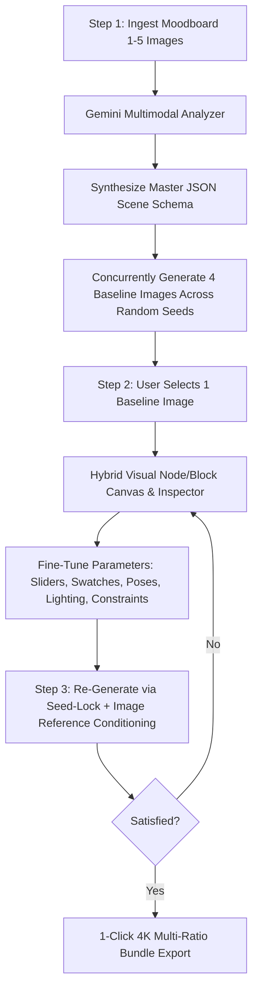

# Product Requirements Document (PRD)
## Image Gen Pipeline Studio

**Document Version**: 2.0  
**Status**: Approved  

---

## 1. Product Overview & Purpose

**Image Gen Pipeline Studio** is a self-contained local web application that transforms reference moodboards into highly controllable, deterministic image generation workflows. Built on a structured **JSON Scene Schema foundation**, the studio enables creators to extract deep visual specifications, generate 4 baseline candidate images, visually inspect and fine-tune complex visual parameters via a **Hybrid Node/Block Canvas & Inspector**, and iteratively re-generate high-fidelity artwork using **Seed-Locking and Image-Reference Conditioning** with zero pixel degradation.

### 1.1 Problem Statement
- **Iterative Edit Degradation**: Modifying images in standard chat interfaces re-encodes canvas previews, introducing blurriness and artifacts across multiple edit passes.
- **Unstructured Prompt Drift**: Flat text prompts lack the depth and isolation needed to tweak specific scene attributes (e.g., changing key light angle or prop color without altering subject identity or composition).
- **Workflow Fragmentation**: Creators waste time manually bridging moodboard analysis, prompt engineering, baseline iteration, and multi-ratio production delivery across disparate tools.

### 1.2 Core Value Proposition
- **Sparse JSON Scene Schema**: Preserves the visual information that applies to each scene without requiring empty sections or fields.
- **Automated 4-Baseline Inception**: Automatically converts the extracted JSON schema into 4 baseline image candidates across distinct seeds for immediate selection.
- **Hybrid Visual Node/Block Canvas & Inspector**: Replaces raw JSON editing with an intuitive visual node graph and dedicated property inspector (sliders, color swatches, spatial frames, and relationship links).
- **Non-Destructive Continuity (Seed + Image Reference)**: Locks the chosen baseline seed and passes the baseline image as reference conditioning alongside JSON parameter deltas to achieve pinpoint edits with zero generational loss.
- **4K Multi-Ratio Production Delivery**: Generates 4K master artwork and exports a 1-click ZIP bundle formatted across 5 target production aspect ratios.

---

## 2. User Journey & Core 3-Step Workflow

### Step 1: Moodboard Ingestion & 4-Baseline Generation
1. The user uploads 1 to 5 moodboard images via drag-and-drop.
2. The system automatically analyzes the images, generates the master **JSON Scene Schema**, and concurrently renders **4 baseline candidate images** (using 4 unique random seeds).

### Step 2: Baseline Selection & Parameter Fine-Tuning
1. The user selects the preferred baseline candidate to enter the fine-tuning workspace.
2. The interface visualizes the JSON schema as an interactive **Node/Block Graph** connected to a central Scene Node.
3. The user selects any node to open its **Property Inspector** and fine-tunes visual parameters (lighting angles, focal length, color palettes, subject poses, materials, and constraints) with real-time feedback.

### Step 3: Non-Destructive Continuous Re-Generation
1. The user triggers re-generation; the system locks the baseline seed and feeds the baseline image as visual reference conditioning alongside the sparse JSON specification.
2. Iterations retain scene identity and spatial coherence without raster compression loss.
3. The user exports the approved 4K artwork in 5 standard production ratios via a single click.

---

## 3. Functional Requirements

### 3.1 Moodboard Vision Analyzer & JSON Schema Extraction
- **FR-1.1 Multi-Image Upload**: Accept 1 to 5 reference images (PNG, JPEG, WebP) via drag-and-drop or file picker.
- **FR-1.2 Sparse JSON Scene Schema Generation**: Automatically synthesize populated, relevant visual sections. `schema_version`, `metadata`, `canvas`, `creative_direction`, and `style` are required; inapplicable sections and fields are omitted.
- **FR-1.3 Direct JSON Generation Input**: Send the cleaned sparse JSON schema directly to the image-generation model, with aspect ratio, seed, and negative-prompt suffixes.

### 3.2 Automated 4-Baseline Candidate Generation
- **FR-2.1 Concurrent Baseline Generation**: Immediately trigger 4 parallel generation requests upon moodboard analysis using unique random seeds (`Seed_01` to `Seed_04`).
- **FR-2.2 Baseline Selection Grid**: Present the 4 generated baselines side-by-side with seed metadata and a single-click "Select Baseline" action to proceed to fine-tuning.

### 3.3 Interactive JSON Graph Canvas & Inspector Studio (JSON Crack Inspired)
- **FR-3.1 Visual Graph Canvas**: Render an interactive, collapsible node-graph canvas (inspired by JSON Crack) where objects, arrays, and primitive fields appear as structured visual nodes with pan, zoom, hierarchy lines, and collapsible branches.
- **FR-3.2 Hybrid Inline & Inspector Editing**:
  - **Inline Micro-Controls**: Edit parameters directly within graph node cells (popover HEX color swatches, number sliders, enum dropdowns, and double-click text editing).
  - **Dedicated Property Inspector**: Selecting any node opens a deep contextual property inspector for bulk adjustments, section locking, and relational link configurations.
- **FR-3.3 Bidirectional Raw JSON Synchronizer**:
  - Toggleable drawer allowing users to inspect and directly edit the underlying JSON schema.
  - Changes in the visual inspector immediately update the JSON, and valid JSON edits instantly reflect in the visual canvas.
- **FR-3.4 Canonical JSON Editing**: The graph and raw JSON editor both update the same sparse schema before re-generating.

### 3.4 Baseline Fine-Tuning & Seed-Locked Continuity
- **FR-4.1 Seed-Locking & Image-Reference Conditioning**: Re-generations lock the chosen baseline seed and supply the baseline image as reference conditioning alongside JSON parameter deltas.
- **FR-4.2 Lossless Iteration**: Re-generation occurs directly from the generation engine without raster re-encoding degradation.
- **FR-4.3 Quick Iteration Loop**: Keyboard shortcut (`Cmd/Ctrl + Enter`) for rapid re-generation with visual loading states.

### 3.5 4K Multi-Ratio Production Export
- **FR-5.1 4K Master Render**: All approved artworks produced in 4K resolution.
- **FR-5.2 5 Standard Production Presets**:
  - `1080 x 1350 px` (4:5 Social Feed)
  - `1080 x 1920 px` (9:16 Story / Mobile Fullscreen)
  - `1440 x 780 px` (~1.85:1 Wide Banner)
  - `1440 x 1440 px` (1:1 High-Res Square)
  - `1730 x 960 px` (~1.8:1 Landscape Display)
- **FR-5.3 1-Click ZIP Export**: Download a ZIP archive containing all 5 formatted images plus schema metadata.

### 3.6 History, Lineage & Version Comparison
- **FR-6.1 State Persistence**: Automatically persist each iteration's generated image, complete JSON schema, parent baseline ID, locked seed, and timestamp.
- **FR-6.2 Branching Version Tree**: Visual lineage tree displaying baseline roots and fine-tuned child iterations.
- **FR-6.3 1-Click State Restore**: Instant restoration of any historical generation's schema and seed back into the workspace.
- **FR-6.4 Side-by-Side Diff Viewer**: Split-slider image comparison with highlighted JSON parameter differences.

### 3.7 Local Deployment & Zero-Setup Distribution
- **FR-7.1 Double-Click macOS Launcher**: A `.command` desktop script that checks dependencies, starts backend/frontend services, and opens the default browser with zero manual setup.
- **FR-7.2 Local SQLite & Storage**: All files and database entries stored locally in `storage/` and `studio.db`.

---

## 4. Non-Functional Requirements

- **NFR-1 Determinism & Edit Isolation**: Parameter adjustments must modify only intended scene elements without unconstrained composition drift.
- **NFR-2 Performance**: 4 baseline generation tasks run concurrently with clear visual progress feedback.
- **NFR-3 Responsiveness**: Real-time updates across the Node Canvas, Inspector, and JSON Synchronizer with < 100ms UI latency.
- **NFR-4 Security & Privacy**: API keys remain in local `.env`; all assets stored locally with zero external telemetry.
- **NFR-5 Stack Standards**: Python FastAPI backend + Modern Web UI (dark-mode studio aesthetics).

---

## 5. Out of Scope (MVP)

- Cloud multi-tenant authentication and team workspaces.
- Real-time video generation and frame animation.
- Cloud storage integration (S3 / Google Drive) — all operations are local disk and ZIP bundles.
