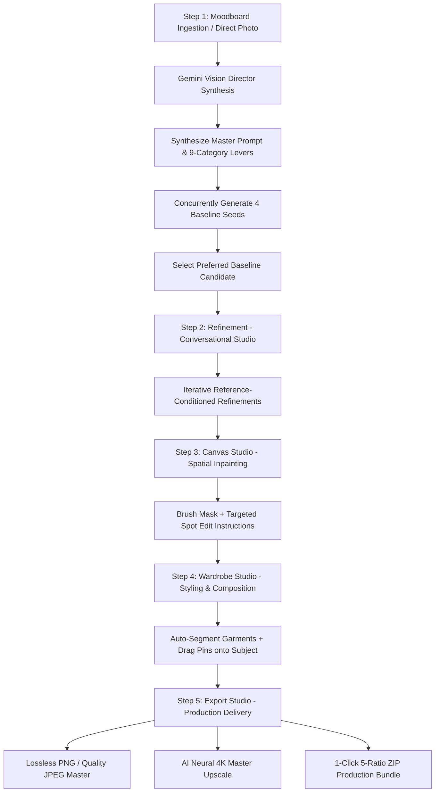

# Product Requirements Document (PRD)
## Image Gen Pipeline Studio

**Document Version**: 5.0  
**Status**: Active / 5-Step Production Studio  
**Last Updated**: 2026-08-31  

---

## 1. Product Overview & Vision

**Image Gen Pipeline Studio** is a self-contained, local creative studio and production pipeline designed for fashion directors, visual artists, and creative teams. It transforms moodboard imagery and creative intent into deterministic, reproducible, and fine-grain controllable image generation workflows using Google GenAI multimodal models.

The studio operates across a **5-Step Sequential Workflow**:

```
[Uploaded Moodboard (1–5) / Direct Photo] + [User Creative Intent]
                                │
                                ▼
  ┌─────────────────────────────────────────────────────────────┐
  │ Step 1: Art Direction (Vision Director & Baselines)         │
  │ • Vision Director synthesizes Master Prompt & Levers        │
  │ • Concurrently renders 4 Baseline Seeds across ratios       │
  │ • Option to skip via Direct Photo Ingestion                 │
  └─────────────────────────────────────────────────────────────┘
                                │
                                ▼
  ┌─────────────────────────────────────────────────────────────┐
  │ Step 2: Refinement (Conversation Studio)                    │
  │ • Conversational natural-language prompts                   │
  │ • Reference image conditioning + Seed lock                  │
  │ • Multi-turn thread history with visual thumbnail timeline  │
  └─────────────────────────────────────────────────────────────┘
                                │
                                ▼
  ┌─────────────────────────────────────────────────────────────┐
  │ Step 3: Canvas Studio (Micro Spatial Inpainting)            │
  │ • Interactive brush masking on full canvas                  │
  │ • Natural language localized spot editing                   │
  │ • Seamless boundary-preserving generative diffusion         │
  └─────────────────────────────────────────────────────────────┘
                                │
                                ▼
  ┌─────────────────────────────────────────────────────────────┐
  │ Step 4: Wardrobe Studio (Multi-Garment Styling & Pins)      │
  │ • Sheet/lookbook auto-detection & segmentation into cards   │
  │ • Drag-and-drop numbered pin placement (①, ②, ③) on subject │
  │ • Multi-image composition conditioning simultaneously       │
  └─────────────────────────────────────────────────────────────┘
                                │
                                ▼
  ┌─────────────────────────────────────────────────────────────┐
  │ Step 5: Export Studio (Production Delivery & 4K Master)     │
  │ • Lossless PNG / Configurable JPEG single-image download    │
  │ • AI-powered neural 4K master restoration & upscale         │
  │ • 1-Click 5-Ratio ZIP Production Bundle with metadata       │
  └─────────────────────────────────────────────────────────────┘
```

---

## 2. Problem Statement & Core Value Proposition

### 2.1 Problem Statement
- **Iterative Edit Degradation**: Chaining edits in typical image generators re-compresses assets with lossy chroma subsampling ($\text{YUV 4:2:0}$), causing chromatic degradation and severe color shifts across iterations.
- **Unstructured Prompt Drift**: Editing isolated details (e.g., lighting or clothing) often mutates character facial identity, composition, and physical environment unintentionally.
- **Fragmented Tooling**: Creators waste significant time bouncing between disparate tools for moodboard analysis, prompt engineering, multi-seed exploration, localized inpainting, multi-garment styling, and production ratio export.

### 2.2 Core Value Proposition
- **5-Step Unified Creative Pipeline**: Smooth transition from Art Direction → Refinement → Canvas → Wardrobe → Export.
- **Chroma & Color Constancy Preservation**: Lossless PNG/WebP multi-turn conditioning, ICC profile preservation, and white balance locks prevent color drift across iterations.
- **Surgical Spatial Inpainting & Interactive Pinning**: Macro conversational refinement, micro canvas brush masking, and visual garment pin-dropping on subjects.
- **Local Data Sovereignty & Auditability**: 100% local persistence in SQLite (`storage/studio.db`) and structured JSONL telemetry (`storage/logs/`).
- **Cost & Token Transparency**: Real-time token and USD cost estimation per operation and accumulated across the full lineage tree.

---

## 3. End-to-End User Journey



### Step 1: Art Direction (Moodboard Ingestion & Baseline Sweep)
1. User uploads 1 to 5 moodboard files (PNG, JPEG, WebP, PDF) and enters a creative prompt (or uploads a direct photo to skip analysis).
2. AI Vision Director (`gemini-3.5-flash-lite` or `gemini-3.7-flash`) analyzes references, synthesizes a 4-phase structured **Master Prompt**, extracts **Scene Narrative**, and populates **9-Category Visual Levers**.
3. The system scans for prompt contradictions and renders 4 concurrent baseline image candidates (`gemini-3.1-flash-lite-image`, `gemini-3.1-flash-image`, or `gemini-3-pro-image`).

### Step 2: Refinement (Conversational Studio)
1. User selects a baseline anchor and enters natural-language refinement instructions (e.g., *"Make lighting golden hour"*, *"Change background to minimalist concrete studio"*).
2. Engine renders iterations using reference image conditioning and locked seeds to maintain subject identity and structure.
3. Every refinement is tracked in an interactive conversation thread timeline.

### Step 3: Canvas Studio (Micro Spatial Inpainting)
1. User paints a binary mask (`#FFFFFF` edit, `#000000` preserve) over target areas with adjustable brush size and undo/redo.
2. User provides a focused instruction (e.g., *"Replace watch with a silver vintage chronometer"*).
3. The inpainting engine modifies only masked pixels while harmonizing boundaries and lighting.

### Step 4: Wardrobe Studio (Garment Extraction & Multi-Pin Styling)
1. User uploads a lookbook or multi-garment sheet. Gemini Vision auto-detects bounding boxes and extracts categorized garment cards.
2. User drags garment cards onto the master image, dropping numbered pins (①, ②, ③) on the subject.
3. Multi-image composition dispatches parent image + garment references simultaneously with anatomical grounding prompts.

### Step 5: Export Studio (Production Delivery & 4K Master)
1. Single-image export in lossless PNG or compressed JPEG (75%–100% quality slider).
2. 1-click AI-powered neural master upscale / restoration for crisp fabric weaves and facial fidelity.
3. 1-click download of the 5-ratio production ZIP bundle (`4:5`, `9:16`, `1.85:1`, `1:1`, `1.8:1`) with JSON lineage metadata.

---

## 4. Functional Requirements

### 4.1 Step 1: Art Direction & Baseline Synthesis
- **FR-1.1 Multi-Format Ingestion**: Ingest 1 to 5 files (PNG, JPEG, WebP, PDF) with drag-and-drop.
- **FR-1.2 Direct Photo Ingestion**: Direct single-image upload bypassing moodboard analysis with automatic aspect ratio detection.
- **FR-1.3 Master Prompt & Lever Extraction**: Synthesize 4-phase Master Prompt, scene logline, and 9-category visual tag chips.
- **FR-1.4 Bi-Directional Re-Sync**: Synchronize Master Prompt from visual levers, or deconstruct Master Prompt back into visual levers.
- **FR-1.5 Conflict Detection**: Identify conflicting lighting, color, or stylistic directives with severity and recommendations.
- **FR-1.6 Parallel 4-Baseline Generation**: Asynchronously render 4 candidate images across distinct seeds.

### 4.2 Step 2: Refinement Studio
- **FR-2.1 Reference-Conditioned Refinement**: Natural-language prompts conditioned on parent image bytes.
- **FR-2.2 Seed-Locking & Continuity**: Maintain seed across turns to preserve anatomical and stylistic consistency.
- **FR-2.3 Conversation Thread Timeline**: Chronological message timeline with thumbnails, seeds, and click-to-load navigation.

### 4.3 Step 3: Canvas Studio (Inpainting)
- **FR-3.1 Interactive Masking**: Full-bleed drawing canvas with customizable brush size, cursor indicator, and Undo/Redo.
- **FR-3.2 Boundary-Preserving Inpainting**: Generates target edits strictly within masked pixels while harmonizing lighting transitions.

### 4.4 Step 4: Wardrobe Studio & Composition
- **FR-4.1 Sheet Auto-Segmentation**: Detect garments from multi-item lookbooks, extract normalized bounding boxes, and save cropped cards.
- **FR-4.2 Drag-and-Drop Pinning**: Position numbered pins (①, ②, ③) on the subject viewport with coordinate tracking.
- **FR-4.3 Multi-Image Composition**: Condition simultaneously on parent master and multiple garment image references in a single API call.
- **FR-4.4 Garment Library Management**: Persistent item storage, metadata inspection, and soft deletion.

### 4.5 Step 5: Export Studio & Production Delivery
- **FR-5.1 Formats & Presets**: Download single master (PNG / JPEG) and 5-ratio ZIP bundle (`4:5`, `9:16`, `1.85:1`, `1:1`, `1.8:1`).
- **FR-5.2 AI Neural Master Upscale**: 4K texture and weave restoration via neural upscale pipeline.
- **FR-5.3 Metadata Bundle**: Embed full generation lineage, seed, prompt, and token cost JSON in export archives.

### 4.6 Cross-Cutting Capabilities
- **FR-6.1 Observability & Telemetry**: Dedicated `/telemetry` dashboard with live audit logs, request lifecycle tracing, SQLite table inspector, and latency/cost metrics.
- **FR-6.2 Lineage History & Split-Slider Diff**: History drawer tracking generation ancestry with side-by-side visual split-slider comparison.
- **FR-6.3 Dynamic Model Switching**: Runtime selection between vision models (`gemini-3.5-flash-lite`, `gemini-3.7-flash`) and image models (`gemini-3.1-flash-lite-image`, `gemini-3.1-flash-image`, `gemini-3-pro-image`).

---

## 5. Technical Stack & Architecture

- **Backend**: Python 3.10+ with FastAPI, Uvicorn, and `uv` package management.
- **Database**: SQLite with `aiosqlite` (`storage/studio.db`).
- **AI Framework**: Google GenAI SDK (`google-genai`) with Interactions API (`client.interactions.create`).
- **Frontend**: React 18+ with Vite, Lucide React icons, and modern dark Vanilla CSS.
- **Image Processing**: Pillow (`PIL`) for chroma preservation, masking, and multi-ratio bundle processing.

---

## 6. Non-Functional Requirements (NFRs)

- **NFR-1 Color & Chroma Constancy**: Reference images encoded in lossless PNG/WebP with ICC profile preservation to eliminate multi-turn degradation.
- **NFR-2 Latency & Concurrency**: 4-baseline generation dispatches concurrently via `asyncio.gather` for minimal turnaround.
- **NFR-3 Local Data Sovereignty**: All generation records, masks, moodboards, and audit logs remain strictly on local storage.
- **NFR-4 UI Fluidity**: 60 FPS canvas painting, drag-and-drop pin tracking, and responsive split-slider comparison.
- **NFR-5 Comprehensive Error Diagnostics**: Structured error parsing and user-friendly alerts for API timeouts, safety filters, and model constraints.
