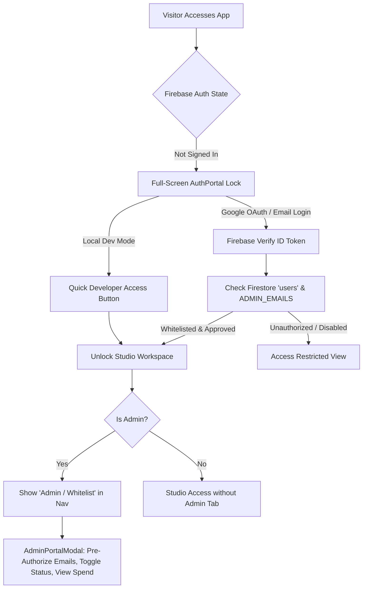

# Technical Specification (SPEC)
## Fashion AI Studio (Image Gen Pipeline)

**Document Version**: 7.0  
**Status**: Active / Production Cloud-Native Specification  
**Last Updated**: 2026-09-01  

---

## 1. System Architecture & Cloud-Native Topology

Fashion AI Studio is a cloud-native, deterministic generative production pipeline deployed on Google Cloud Platform and Firebase Hosting.

```
┌────────────────────────────────────────────────────────────────────────────┐
│                    FIREBASE HOSTING & GLOBAL CDN EDGE                      │
│  • Production URL: https://ai-art-director-prod.web.app                    │
│  • Edge Rewrites: /api/** -> Cloud Run | /health -> Cloud Run | ** -> SPA  │
│  • React SPA: 5-Step Workflow, Canvas Studio, Wardrobe Studio, AuthPortal, │
│    AdminPortalModal, History Drawer, Observability Dashboard               │
└─────────────────────────────────────┬──────────────────────────────────────┘
                                      │ HTTPS / Same-Origin API Requests
                                      ▼
┌────────────────────────────────────────────────────────────────────────────┐
│                       GOOGLE CLOUD RUN BACKEND SERVICE                     │
│  • Service Name: fashion-art-director (asia-southeast1, auto-scaling 0–5)  │
│  • Runtime: Python 3.11-slim + uv + Uvicorn (FastAPI)                      │
│  • Auth Dependency: Firebase Auth JWT Token & Whitelist Verification       │
│  • API Routers: auth, config, moodboard, generation, refinement, inpaint,  │
│    wardrobe, export, history, telemetry                                    │
│  • Edge Proxy: /api/images/{file_path:path} -> HTTP 307 Signed GCS URL     │
└──────┬──────────────┬──────────────┬──────────────┬──────────────┬─────────┘
       │              │              │              │              │
       ▼              ▼              ▼              ▼              ▼
┌──────────────┐┌──────────────┐┌──────────────┐┌──────────────┐┌────────────┐
│Vision Service││Gen Service   ││Wardrobe Svc  ││Export Service││Telemetry & │
│• Flash Lite  ││• Flash/Pro   ││• Segmentation││• 4K Upscale  ││Cost Engine │
│• Master Extr ││  Image       ││• Pin Dropper ││• 5-Ratio ZIP ││• Pricing   │
│• 9-Taxonomy  ││• Seed Lock   ││• Multi-Part  ││• PIL Crop    ││• Auditing  │
└──────┬───────┘└──────┬───────┘└──────┬───────┘└──────┬───────┘└─────┬──────┘
       │               │               │               │              │
       ▼               ▼               ▼               ▼              ▼
┌────────────────────────────────────────────────────────────────────────────┐
│                   MANAGED GOOGLE CLOUD INFRASTRUCTURE                      │
│  • Google GenAI Interactions API (gemini-3.5-flash-lite, gemini-3-pro-image)│
│  • Cloud Firestore: 8 Flat Collections with Multi-User Query Isolation     │
│  • Cloud Storage: gs://ai-art-director-prod-store (CORS + Signed URLs)     │
│  • Secret Manager: GEMINI_API_KEY (Accessed by studio-runner SA)           │
│  • CI/CD: GitHub Actions with Keyless Workload Identity Federation (WIF)   │
└────────────────────────────────────────────────────────────────────────────┘
```

---

## 2. Cloud Firestore Data Models & Schemas

The database layer utilizes **Google Cloud Firestore** in Native Mode (`ai-art-director-prod`).

### 2.1 Collections Schema

#### 1. `users`
Tracks authorized studio team members, roles, approval statuses, and cumulative spend metrics.
```json
{
  "id": "user_firebase_uid",
  "email": "director@fashionstudio.com",
  "display_name": "Fashion Director",
  "photo_url": "https://example.com/avatar.jpg",
  "role": "admin",
  "status": "approved",
  "invited_by": "system_bootstrap",
  "created_at": "2026-09-01T12:00:00Z",
  "approved_at": "2026-09-01T12:00:00Z",
  "last_login_at": "2026-09-01T15:00:00Z",
  "total_spend_usd": 2.45,
  "total_tokens": 14200
}
```

#### 2. `moodboards`
Stores moodboard ingestion batches, uploaded file GCS paths, and upstream analysis costs.
```json
{
  "id": "mb_abc123",
  "user_id": "user_firebase_uid",
  "created_at": "2026-09-01T12:00:00Z",
  "image_paths": ["moodboards/mb_abc123/ref_0.png"],
  "cost_usd": 0.0012,
  "tokens": 450,
  "accumulated_cost_usd": 0.0012,
  "accumulated_tokens": 450
}
```

#### 3. `generations`
Stores rendered images, prompts, seeds, aspect ratios, model names, parent lineage pointers, and pre-aggregated costs.
```json
{
  "id": "gen_def456",
  "user_id": "user_firebase_uid",
  "parent_id": "gen_root_001",
  "moodboard_id": "mb_abc123",
  "is_baseline": false,
  "created_at": "2026-09-01T12:05:00Z",
  "schema_json": "{\"categories\": {...}, \"narrative\": \"...\"}",
  "compiled_prompt": "High fashion editorial photo...",
  "negative_prompt": "blurry, low quality, oversaturated",
  "seed": 4289102,
  "master_image_path": "generations/gen_def456.png",
  "aspect_ratio": "2:3",
  "resolution_width": 1440,
  "resolution_height": 2160,
  "conversation_id": "conv_789",
  "model_name": "gemini-3-pro-image",
  "cost_usd": 0.080,
  "tokens": 0,
  "accumulated_cost_usd": 0.1612,
  "accumulated_tokens": 450
}
```

#### 4. `conversations`
Tracks multi-turn refinement threads anchored to a root baseline generation.
```json
{
  "id": "conv_789",
  "user_id": "user_firebase_uid",
  "baseline_generation_id": "gen_root_001",
  "moodboard_id": "mb_abc123",
  "created_at": "2026-09-01T12:01:00Z"
}
```

#### 5. `wardrobe_items`
Tracks segmented wardrobe pieces, bounding boxes, categories, and optional 4K AI upscales.
```json
{
  "id": "wardrobe_item_001",
  "user_id": "user_firebase_uid",
  "source_image_path": "wardrobe/sources/lookbook_01.png",
  "label": "Silk Emerald Blazer",
  "category": "outerwear",
  "cropped_image_path": "wardrobe/items/crop_001.png",
  "upscaled_image_path": "wardrobe/upscales/upscale_001.png",
  "upscale_status": "completed",
  "upscale_error": null,
  "bbox_json": "[120, 250, 680, 750]",
  "extracted_details_json": "{\"fabric\": \"silk satin\", \"color\": \"emerald green\"}",
  "cost_usd": 0.030,
  "tokens": 0,
  "created_at": "2026-09-01T12:10:00Z",
  "deleted_at": null
}
```

#### 6. `composition_assignments`
Records numbered pins dropped on viewport coordinates linking a generation to wardrobe library items.
```json
{
  "id": "asgn_001",
  "user_id": "user_firebase_uid",
  "generation_id": "gen_def456",
  "wardrobe_item_id": "wardrobe_item_001",
  "pin_number": 1,
  "drop_position_json": "{\"x\": 0.48, \"y\": 0.35}",
  "target_description": "Silk Emerald Blazer",
  "region_bbox_json": null,
  "created_at": "2026-09-01T12:12:00Z"
}
```

#### 7. `telemetry_events`
Stores request lifecycle and audit logs dispatched asynchronously via background threads.
```json
{
  "id": "evt_abc123",
  "user_id": "user_firebase_uid",
  "timestamp": "2026-09-01T12:05:01Z",
  "event": "generate_refinement",
  "component": "GenerationService",
  "request_id": "req_xyz987",
  "status": "success",
  "duration_ms": 2840.5,
  "cost_usd": 0.080,
  "tokens": 0,
  "details_json": "{\"model\": \"gemini-3-pro-image\", \"seed\": 4289102}"
}
```

#### 8. `usage_daily`
Tracks aggregated daily spend per user to enforce optional budget caps.
```json
{
  "id": "user_firebase_uid_2026-09-01",
  "user_id": "user_firebase_uid",
  "date": "2026-09-01",
  "total_cost_usd": 1.45,
  "request_count": 18
}
```

---

## 3. Storage Architecture & GCS Signed URLs

1. **Storage Bucket**: `gs://ai-art-director-prod-store` (Region: `asia-southeast1`).
2. **CORS Policy**: Configured on the bucket to allow `GET`, `PUT`, `POST`, `OPTIONS` from any origin with `Content-Type`, `Content-Disposition`, `Authorization`.
3. **Edge Image Delivery Route (`/api/images/{file_path:path}`)**:
   - Checks local disk first (for zero-latency local development).
   - In cloud mode, generates a 60-minute Google Cloud Storage Signed URL and responds with `HTTP 307 Temporary Redirect` to stream directly from Google's high-speed CDN.

---

## 4. Authentication, Security & Whitelist Architecture



1. **Full-Screen Luxury AuthPortal & App Lock**:
   - When unauthenticated or unapproved, the Studio workspace (canvas, tools, drawer) is completely unmounted and locked behind `AuthPortal.jsx`.
   - Supports 1-click Google OAuth popup and Email/Password sign-in/registration.
   - Includes a **Developer Quick Access** option in `ENVIRONMENT=local` mode.
   - Displays an **Access Restricted** state for authenticated users who are not yet on the studio whitelist, preventing unauthorized access.

2. **Invite-Only Whitelist & Admin Authorization**:
   - **Initial Admin Bootstrap**: Configured via `ADMIN_EMAILS` environment variable (comma-separated). Matching emails are automatically granted `role="admin"` and `status="approved"`.
   - **In-App Admin Management (`AdminPortalModal.jsx`)**: Allows administrators to pre-authorize new member emails (`user` vs `admin`), toggle account status (`approved`, `disabled`), revoke invites, and monitor real-time compute spend per member.
   - **Auth API Endpoints (`/api/auth`)**:
     - `GET /api/auth/me`: Returns user profile, role, and approval status without throwing 403.
     - `GET /api/auth/users`: (Admin only) Lists all members, pending invites, and cumulative spend metrics.
     - `POST /api/auth/invite`: (Admin only) Pre-authorizes a new member email.
     - `PATCH /api/auth/users/{user_id}/status`: (Admin only) Updates approval status or role.
     - `DELETE /api/auth/users/{user_id}`: (Admin only) Removes a member from the whitelist.

3. **FastAPI Security Dependencies (`src/app/auth/firebase_auth.py`)**:
   - `get_raw_user`: Extracts raw JWT token from `Authorization: Bearer <token>` or supports local dev bypass token.
   - `get_current_user_profile`: Resolves and synchronizes the user profile in Firestore.
   - `get_current_user`: Enforces `status == "approved"`, raising `403 Forbidden` for unauthorized or disabled users.
   - `get_admin_user`: Enforces `role == "admin"`, raising `403 Forbidden` for non-administrators.

---

## 5. CI/CD & Workload Identity Federation (WIF)

Continuous Integration and Deployment is fully automated via GitHub Actions without storing long-lived service account JSON keys in repository secrets:

1. **GCP Workload Identity Pool**: `projects/1012864945903/locations/global/workloadIdentityPools/github-actions-pool`
2. **OIDC Provider**: `github-actions-provider` with assertion condition `assertion.repository == 'zacangzz/fashion-art-director'`.
3. **Deployer Service Account**: `github-deployer@ai-art-director-prod.iam.gserviceaccount.com`
4. **Pipeline Workflow (`.github/workflows/deploy.yml`)**:
   - Runs on push / pull request to `main`.
   - Executes Pytest backend suite (85 tests) and Vitest frontend suite (109 tests).
   - Builds multi-stage Docker container and deploys revision to Cloud Run.
   - Builds frontend dist and deploys Firebase Hosting rewrites, Firestore rules, and Firestore indexes.
