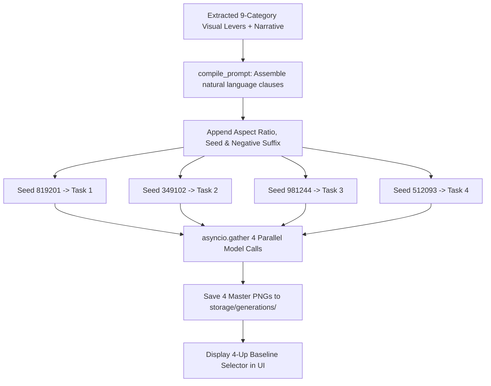
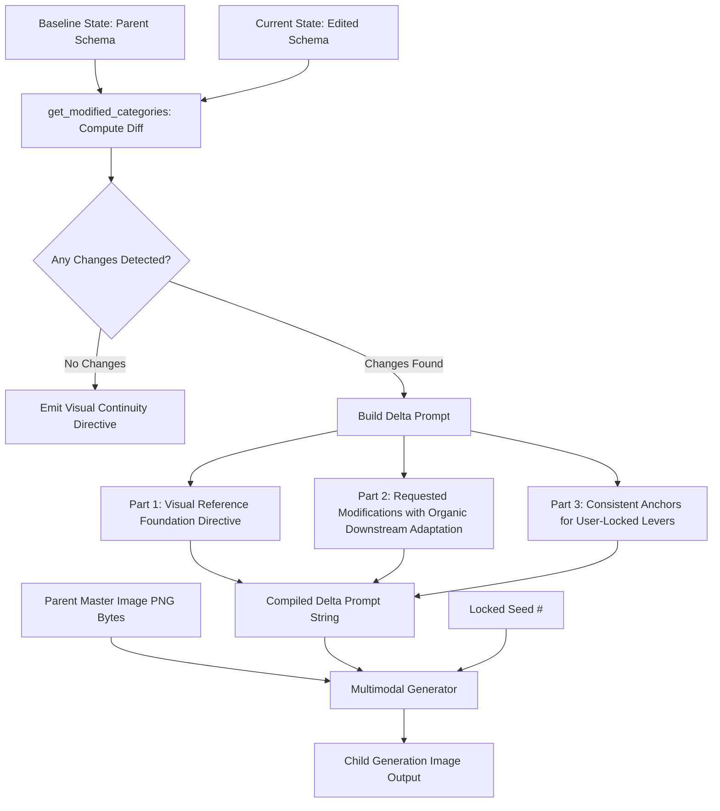

# Comprehensive Prompting Architecture, Prompts & End-to-End Data Flow Report

---

## 1. Executive Summary & Prompting Philosophy

The core goal of this application is to generate highly reproducible, authentic, and easily controllable images based on a user's creative baseline and uploaded moodboards.

To achieve this, the pipeline is architected around a **Hierarchical Synthesis & Dual-Level Studio Model**:

```
[Uploaded Moodboard Files] + [User Creative Intent & Requirements]
                                │
                                ▼
         ┌──────────────────────────────────────────────┐
         │ Phase 1: AI Vision Director Synthesis        │
         │ - Synthesizes the OPTIMAL Master Prompt      │
         │ - Decomposes scene into 9 Visual Levers      │
         └──────────────────────────────────────────────┘
                                │
                                ▼
         ┌──────────────────────────────────────────────┐
         │ Phase 2: Exploratory 4-Seed Baseline Sweep   │
         │ - Generates 4 initial visual anchors         │
         └──────────────────────────────────────────────┘
                                │
             ┌──────────────────┴──────────────────┐
             ▼                                     ▼
┌───────────────────────────────┐     ┌───────────────────────────────┐
│ Phase 3: Macro Editing Studio │     │ Phase 4: Micro Editing Studio │
│      (Tag Editing Studio)     │     │       (Canvas Studio)         │
│ - High-level scene tuning     │     │ - Surgical localized edits    │
│ - Global attribute levers     │     │ - Brush-masked inpainting     │
│ - Weight emphasis & toggles   │     │ - Pixel-level boundary blend  │
│ - Zero-drift Delta Prompting  │     │ - Preserves surrounding image │
└───────────────────────────────┘     └───────────────────────────────┘
```

---

## 2. The Hierarchical Editing Hierarchy: Macro vs. Micro

The application provides two complementary levels of creative control:

### 1. Macro Editing (The Tag Studio)
* **Scope**: Global scene composition, atmosphere, character attributes, and stylistic direction.
* **Mechanism**: The user tunes the 9 visual levers (enabling/disabling tags, adjusting weights from 0.5x to 2.0x, adding custom descriptors, locking categories, or editing the scene narrative).
* **AI Execution**: Uses the **Delta Prompt Compiler** (`compile_delta_prompt`) with parent image reference bytes and seed locking to adjust only modified dimensions while preserving character identity and background integrity.

### 2. Micro Editing (The Canvas Studio)
* **Scope**: Surgical, localized spatial inpainting.
* **Mechanism**: The user draws a brush mask (`#FFFFFF`) directly over a specific region of the image on the canvas (e.g. repainting hands, swapping an accessory, or replacing a prop).
* **AI Execution**: Uses **Spatial Masked Inpainting** (`inpaint_region`) with strict pixel immutability rules for non-masked pixels and seamless boundary blending.

---

## 3. The 9-Category Visual Taxonomy (The Macro Levers)

The visual levers extracted from the moodboard and user prompt are organized into 9 orthogonal categories:

| Category Key | Category Display Label | UI Color | Description & Visual Descriptors |
| :--- | :--- | :--- | :--- |
| `subject_details` | **Subject & Character Details** | `#06b6d4` | Facial anatomy, expression, gaze, posture, age, ethnicity, build. |
| `wardrobe_hair` | **Wardrobe & Hairstyle** | `#ec4899` | Garments, fabrics, textures, tailoring, hair style, hair color, finish. |
| `objects_props` | **Objects & Key Props** | `#f97316` | Furniture, tools, accessories, handheld or foreground props. |
| `environment` | **Environment & Setting** | `#84cc16` | Spatial architecture, backdrop, landscape, interior elements, greenery. |
| `layout_framing` | **Layout & Framing** | `#10b981` | Cinematic shot type (medium-wide, close-up), rule-of-thirds, perspective. |
| `lighting` | **Lighting & Atmosphere** | `#f59e0b` | Key/fill balance, directional sunlight, neon rim lighting, volumetrics. |
| `color_profile` | **Color Profile & Palette** | `#e11d48` | Dominant hues, contrast levels, film stock emulation (e.g. Kodak Portra). |
| `camera_optics` | **Camera & Optical Specs** | `#a855f7` | Lens focal length (e.g. 35mm prime), aperture (f/2.0), depth of field, grain. |
| `mood_era` | **Mood, Vibe & Era** | `#3b82f6` | Period aesthetic (1970s luxury, retro commercial, modern high-fashion). |
| `custom` | **Custom Tags** | `#64748b` | User-defined ad-hoc visual tags and modifiers. |

---

## 4. Phase 1: AI Vision Director & Master Prompt Synthesis

### 4.1. The Role of the Vision Model
In Phase 1, Gemini 3.1 Flash Lite acts as an **Executive Visual Director & Prompt Architect**. It analyzes the moodboard imagery in combination with the user's creative prompt to:
1. Synthesize the **Optimal Master Prompt**: A definitive, high-fidelity prompt with natural phrasing, camera optics, physical materials, and lighting descriptors that best produces the moodboard look.
2. Formulate the **Core Creative Narrative**: A concise 1-2 sentence scene logline.
3. Extract the **9-Category Visual Levers**: 2–5 high-impact keyword descriptors per category with default weights (`1.0`) so the user can immediately refine the prompt at a macro level in the Tag Studio.

### 4.2. Actual Prompt Files

#### A. Extraction System Prompt (`src/app/prompts/extraction_system.txt`)
```text
You are an executive visual director, master cinematographer, and elite image generation prompt architect.
Your mission is to analyze the reference moodboard images and user creative requirements, then synthesize the OPTIMAL, highest-fidelity generation prompt alongside its constituent visual levers.

You must return a single, valid JSON object with EXACTLY this structure:
{
  "master_prompt": "A complete, highly polished, evocative Master Generation Prompt designed to produce the definitive image matching the moodboard and requirements. Synthesize the scene, subject, wardrobe, environment, lighting, optics, color profile, and artistic aesthetic into a cohesive, cinematic description.",
  "narrative": "A concise 1-2 sentence core creative scene logline capturing the primary subject, action, setting, and emotional tone.",
  "categories": {
    "subject_details": [
      {"label": "e.g. young boy with copper ginger hair", "weight": 1.0},
      {"label": "e.g. seated with right hand raised to mouth", "weight": 1.0}
    ],
    "objects_props": [
      {"label": "e.g. terracotta mid-century outdoor sofa", "weight": 1.0},
      {"label": "e.g. woven slate blue cushions", "weight": 1.0}
    ],
    "wardrobe_hair": [
      {"label": "e.g. wind-tousled wavy ginger hair", "weight": 1.0},
      {"label": "e.g. cream ribbed cotton knit sweater", "weight": 1.0}
    ],
    "environment": [
      {"label": "e.g. sunlit modernist terrace patio", "weight": 1.0},
      {"label": "e.g. lush Mediterranean pine trees in background", "weight": 1.0}
    ],
    "layout_framing": [
      {"label": "e.g. medium-wide cinematic composition", "weight": 1.0},
      {"label": "e.g. rule-of-thirds asymmetric balance", "weight": 1.0}
    ],
    "lighting": [
      {"label": "e.g. warm direct late-afternoon golden sunlight", "weight": 1.0},
      {"label": "e.g. soft diffused ambient fill with gentle shadows", "weight": 1.0}
    ],
    "color_profile": [
      {"label": "e.g. warm terracotta, slate blue, and olive green palette", "weight": 1.0},
      {"label": "e.g. natural Kodak Portra film color grade", "weight": 1.0}
    ],
    "camera_optics": [
      {"label": "e.g. shot on 35mm prime lens", "weight": 1.0},
      {"label": "e.g. shallow depth of field f/2.0 with subtle organic grain", "weight": 1.0}
    ],
    "mood_era": [
      {"label": "e.g. 1970s retro luxury editorial vibe", "weight": 1.0},
      {"label": "e.g. playful, candid high-end commercial aesthetic", "weight": 1.0}
    ]
  }
}

Directives:
1. MASTER PROMPT EXCELLENCE: The `master_prompt` must be rich, concrete, evocative, and free of vague buzzwords. It should incorporate specific camera optics, lighting behavior, physical materials, and atmospheric depth inspired by the moodboard files.
2. MODULAR LEVERS: Extract 2 to 5 specific, high-value visual keyword descriptors for each of the 9 categories so the user can perform high-level macro adjustments in the Tag Studio.
3. COMPLETENESS: Never omit categories. Always provide relevant visual tags across all 9 dimensions.
```

#### B. User Baseline Template (`src/app/prompts/user_baseline_template.txt`)
```text
USER CREATIVE BASELINE & INTENT:
<user_requirements>
{USER_PROMPT}
</user_requirements>

Analyze the moodboard images in conjunction with the user's creative requirements. Synthesize the optimal Master Generation Prompt and break down its core visual levers across all 9 categories.
```

---

## 5. Phase 2: Exploratory 4-Seed Baseline Sweep (Approach A: 1:1 Tag Compilation)

### 5.1. Overview & Data Flow
Under **Approach A**, the initial baseline prompt is **deterministically compiled directly from the 9-category visual levers and scene narrative** (`compile_prompt(narrative, categories)`). This ensures 100% lockstep alignment between the rendered baseline images and the Tag Studio chips.



### 5.2. Image Generation Suffix & Defaults
* **Suffix File** (`src/app/prompts/image_generation_suffix.txt`):
  ```text
  Aspect ratio: {ASPECT_RATIO}. Seed: {SEED}. Do not include: {NEGATIVE_PROMPT}.
  ```
* **Default Negative Prompt** (`src/app/prompts/defaults.json`):
  ```json
  {
    "negative_prompt": "blurry, low quality, distorted anatomy"
  }
  ```

---

## 6. Phase 3: Macro Editing (Tag Studio & Delta Prompting)

### 6.1. Macro Scene Refinement
In the Tag Studio, the user can adjust global scene levers without re-synthesizing the entire prompt from scratch:
* **Toggle Tags**: Enable or disable specific descriptors.
* **Weight Scrubbing**: Increase or decrease chip emphasis (weights $> 1.25$ format as `(tag:weight)`).
* **Add Custom Tags**: Insert ad-hoc keywords.
* **Lock Categories**: Prevent specific dimensions from drifting.

### 6.2. The Delta Prompt Compiler (`compile_delta_prompt`)
When generating an iteration, the backend compares the baseline state against the modified state:



#### Delta Prompt Structure Example (when Subject & Environment are locked):
```text
Visual Reference Foundation: Use the reference image as the structural, character, and stylistic anchor. Apply the requested modifications below seamlessly, allowing all naturally interconnected visual elements—including lighting falloff, cast shadows, color bounce, material reactions, and environmental reflections—to adjust organically for realistic visual cohesion.

Requested Modifications: Wardrobe & Hairstyle: wearing ivory cashmere roll-neck sweater. Lighting: illuminated with soft diffused overcast ambient daylight.

Consistent Anchors: Maintain the core design, identity, and styling of Subject & Character Details, Environment & Setting, while allowing them to interact realistically with the updated scene conditions. Aspect ratio: 2:3. Seed: 4289102. Do not include: blurry, low quality, distorted anatomy.
```

---

## 7. Phase 4: Micro Editing (Canvas Studio & Spatial Inpainting)

### 7.1. Precision Localized Editing
For surgical changes that should not affect the rest of the image:
1. The user paints a white mask (`#FFFFFF`) over the target region on the Canvas Studio.
2. The user types a specific inpainting task instruction (e.g. *"Replace handheld glass with a vintage leather notebook"*).
3. The system dispatches the Source Image + Binary Mask Image + Spatial Prompt.

### 7.2. Inpaint System Prompt (`src/app/prompts/inpaint_system.txt`)
```text
You are a precision image editor. You will receive two images and an edit instruction.

Image 1 — SOURCE IMAGE: The original artwork to be edited. Treat every pixel outside the mask region as read-only. Reproduce them with pixel-perfect fidelity.

Image 2 — MASK IMAGE: A black-and-white map. WHITE pixels mark the region you must edit. BLACK pixels mark the region you must preserve exactly — do not alter any color, texture, shading, edge, or detail in the black region.

EDIT INSTRUCTION:
<edit>
{USER_PROMPT}
</edit>

Rules:
1. Apply the edit ONLY inside the white mask region.
2. Blend the edited region seamlessly with the surrounding untouched area (match lighting, shadow direction, color temperature, and texture scale at the mask boundary).
3. Preserve the exact composition, camera angle, depth of field, and aspect ratio.
4. Output a single image at the same resolution as the source image.
5. Do not add, remove, or reposition any element outside the white mask region.
```

---

## 8. Summary Comparison: Macro vs. Micro Workflow

| Feature | Macro Editing (Tag Studio) | Micro Editing (Canvas Studio) |
| :--- | :--- | :--- |
| **Editing Level** | High-level (Global scene & parameters) | Low-level (Surgical spatial region) |
| **User Input** | Visual keyword tags, weights, narrative | Brush mask on canvas + localized edit text |
| **AI Prompting** | 3-Part Delta Prompt (Preservation + Adjustments) | Spatial Binary Masking + Boundary Blending Prompt |
| **Multimodal Inputs** | Parent Master Image Bytes + Delta Text Prompt | Source Image + Binary Mask Image + Task Prompt |
| **Preservation Target**| Character identity, overall pose, aesthetic tone | Exact pixels outside mask (`#000000` read-only) |
| **Primary Use Cases** | Swapping wardrobe color, altering lighting, tuning mood | Fixing hands, swapping props, retouching hair/face |
