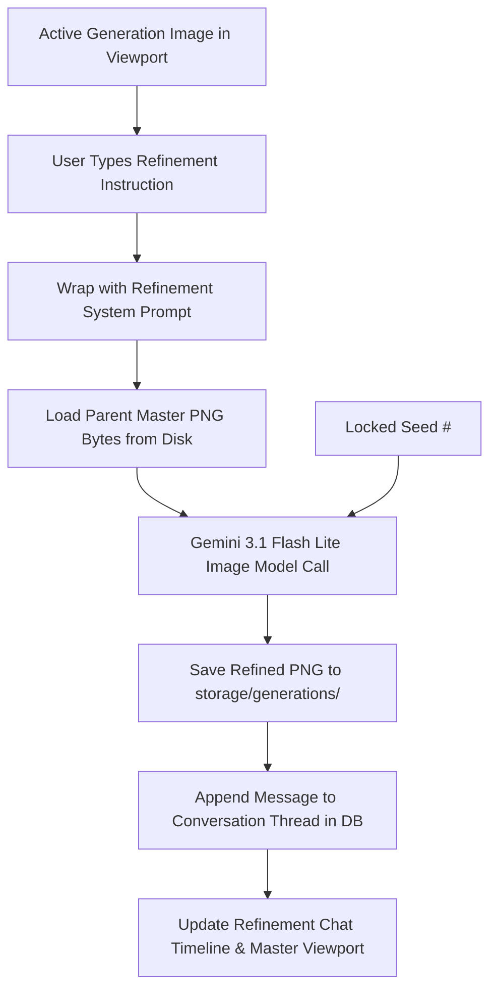

# Comprehensive Prompting Architecture, Prompts & End-to-End Data Flow Report

---

## 1. Executive Summary & Prompting Philosophy

The core goal of this application is to generate highly reproducible, authentic, and easily controllable images based on a user's creative baseline and uploaded moodboards.

To achieve this, the pipeline is architected around a **4-Step Sequential Studio Architecture**:

```
[Uploaded Moodboard Files] + [User Creative Intent & Requirements]
                                │
                                ▼
         ┌──────────────────────────────────────────────┐
         │ Step 1: Art Direction (Vision & Baselines)   │
         │ - Synthesizes the OPTIMAL Master Prompt      │
         │ - Generates 4 initial exploratory seeds      │
         └──────────────────────────────────────────────┘
                                │
                                ▼
         ┌──────────────────────────────────────────────┐
         │ Step 2: Refinement (Conversation Studio)     │
         │ - Conversational natural-language prompts    │
         │ - Reference image conditioning + Seed lock   │
         │ - Complete message thread timeline           │
         └──────────────────────────────────────────────┘
                                │
                                ▼
         ┌──────────────────────────────────────────────┐
         │ Step 3: Canvas Studio (Micro Inpainting)     │
         │ - Surgical brush-masked inpainting           │
         │ - Pixel-level boundary blending              │
         │ - Strict preservation of untouched pixels    │
         └──────────────────────────────────────────────┘
                                │
                                ▼
         ┌──────────────────────────────────────────────┐
         │ Step 4: Export Studio (Production Delivery)  │
         │ - Single Master PNG / JPEG downloads         │
         │ - 1-Click 5-Ratio Production Bundle (.ZIP)   │
         │ - Full lineage tracking & audit logging      │
         └──────────────────────────────────────────────┘
```

---

## 2. The Multi-Tier Editing Hierarchy: Macro Refinement vs. Micro Canvas

The application provides two complementary levels of creative control:

### 1. Step 2: Refinement Studio (Conversational Prompting)
* **Scope**: Natural language, holistic adjustments (lighting, color grade, mood, wardrobe changes, camera framing).
* **Mechanism**: The user types free-text instructions (e.g. *"Change lighting to warm golden hour"* or *"Make the background a modern minimalist loft"*).
* **AI Execution**: Uses **Reference-Conditioned Refinement** (`/api/refine` via `gemini-3.1-flash-lite-image`). The engine feeds the parent master image bytes along with the user's prompt wrapped in a relaxed refinement directive, preserving core character and composition anchors while naturally adjusting interconnected physics (shadows, reflections, specular highlights).

### 2. Step 3: Canvas Studio (Micro Spatial Inpainting)
* **Scope**: Surgical, localized spatial inpainting.
* **Mechanism**: The user draws a brush mask (`#FFFFFF`) directly over a specific region of the image on the canvas (e.g. repainting hands, swapping an accessory, or replacing a prop).
* **AI Execution**: Uses **Spatial Masked Inpainting** (`inpaint_region` via `gemini-3.1-flash-image`) with strict pixel immutability rules for non-masked pixels (`#000000`) and seamless boundary blending.

---

## 3. Step 1: AI Vision Director & Master Prompt Synthesis

### 3.1. The Role of the Vision Model
In Step 1, Gemini 3.5 Flash Lite (or 3.7 Flash) acts as an **Executive Visual Director & Prompt Architect**. It analyzes the moodboard imagery in combination with the user's creative prompt to:
1. Synthesize the **Optimal Master Prompt**: A definitive, hyper-specific prompt formatted in 4-phase structured sequential prose (Context & Intent -> Subject & Styling -> Spatial Environment & Props -> Lighting & Optical Physics) crafted specifically for Google's multimodal Gemini Image models ("Nano Banana" / `gemini-3.1-flash-image` family).
2. Formulate the **Core Creative Intent**: Explicit scene context, editorial purpose, and mood.
3. Extract **Visual Levers**: Hyper-specific, granular keyword descriptors across 9 visual taxonomy dimensions with conflict QA auditing.

### 3.2. Extraction Prompt Templates

#### A. Extraction System Prompt (`src/app/prompts/extraction_system.txt`)
```text
You are an executive visual director, master cinematographer, and elite image generation prompt architect.
Your mission is to analyze the reference moodboard images and user creative requirements, then synthesize the OPTIMAL, highest-fidelity generation prompt alongside its constituent visual levers.

TARGET MODEL AWARENESS:
You are crafting the `master_prompt` specifically for Google's multimodal Gemini Image models ("Nano Banana" / gemini-3.1-flash-image family)...
```

#### B. User Baseline Template (`src/app/prompts/user_baseline_template.txt`)
```text
USER CREATIVE BASELINE & INTENT:
<user_requirements>
{USER_PROMPT}
</user_requirements>

Analyze the moodboard images in conjunction with the user's creative requirements. Synthesize the optimal Master Generation Prompt for Google's multimodal Gemini Image models ("Nano Banana" / gemini-3.1-flash-image family), following the 4-phase structured sequential prose: (1) Creative Intent & Scene Context, (2) Hyper-specific Subject & Styling, (3) Spatial Environment & Props, and (4) Exact Lighting & Optical Physics...
```

---

## 4. Step 2: Conversation-Based Refinement Architecture

### 4.1. Overview & Data Flow



### 4.2. Refinement System Prompt (`src/app/prompts/refinement_system.txt`)
```text
You are an image refinement assistant. You will receive a reference image and an edit instruction.

Use the reference image as a starting point. Apply the user's requested modifications naturally, allowing interconnected visual elements — lighting, shadows, colors, materials, reflections — to adapt organically for realistic cohesion.

EDIT INSTRUCTION:
<edit>
{USER_PROMPT}
</edit>
```

---

## 5. Step 3: Micro Editing (Canvas Studio & Spatial Inpainting)

### 5.1. Precision Localized Editing
For surgical changes that should not affect the rest of the image:
1. The user paints a white mask (`#FFFFFF`) over the target region on the Canvas Studio.
2. The user types a specific inpainting task instruction (e.g. *"Replace handheld glass with a vintage leather notebook"*).
3. The system dispatches the Source Image + Binary Mask Image + Spatial Prompt.

### 5.2. Inpaint System Prompt (`src/app/prompts/inpaint_system.txt`)
```text
You are a precision image editor. You will receive two images and an edit instruction.

Image 1 — SOURCE IMAGE: The original artwork to be edited. Treat every pixel outside the mask region as read-only. Reproduce them with pixel-perfect fidelity.

Image 2 — MASK IMAGE: A black-and-white map. WHITE pixels mark the region you must edit. BLACK pixels mark the region you must preserve exactly — do not alter any color, texture, shading, edge, or detail in the black region.

EDIT INSTRUCTION:
<edit>
{USER_PROMPT}
</edit>
```

---

## 6. Step 4: Export Studio & Multi-Ratio Delivery

### 6.1. Standard Production Ratios
All master generations can be packaged into 5 standard production ratios using PIL image transformations:

| Preset | Target Resolution | Aspect Ratio | Use Case |
| :--- | :--- | :--- | :--- |
| **Social Feed** | `1080 x 1350 px` | `4:5` | Instagram Portrait & Feed Posts |
| **Story / Fullscreen** | `1080 x 1920 px` | `9:16` | Reels, TikTok & Mobile Stories |
| **Wide Banner** | `1440 x 780 px` | `~1.85:1` | Hero banners & web landscape |
| **High-Res Square** | `1440 x 1440 px` | `1:1` | Standard high-res square formats |
| **Landscape Display** | `1730 x 960 px` | `~1.8:1` | Desktop wallpaper & display cards |

---

## 7. Summary Comparison: Workflow Steps

| Step | Studio Step | User Action | AI Model | Key Output |
| :--- | :--- | :--- | :--- | :--- |
| **Step 1** | **Art Direction** | Upload 1–5 moodboards + starting prompt | `gemini-3.1-flash-lite` + `gemini-3.1-flash-lite-image` | Master Prompt + 4 Baseline candidates |
| **Step 2** | **Refinement** | Conversational free-text editing | `gemini-3.1-flash-lite-image` | Iterative generations linked in thread |
| **Step 3** | **Canvas** | Draw brush mask + localized edit instruction | `gemini-3.1-flash-image` | Seamless spatial inpainting edit |
| **Step 4** | **Export** | Choose single PNG/JPEG or 5-Ratio ZIP | Local Pillow (PIL) | Downloadable asset files & metadata |
