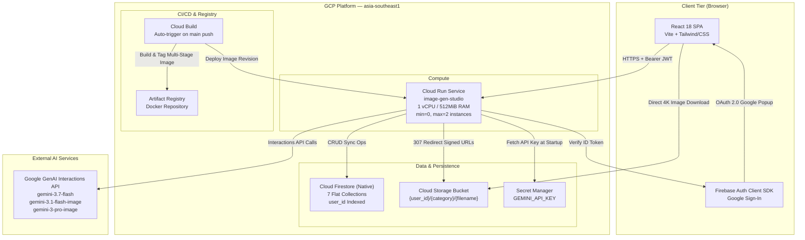
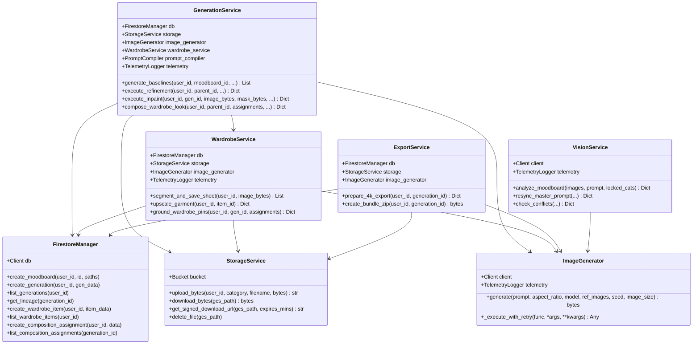
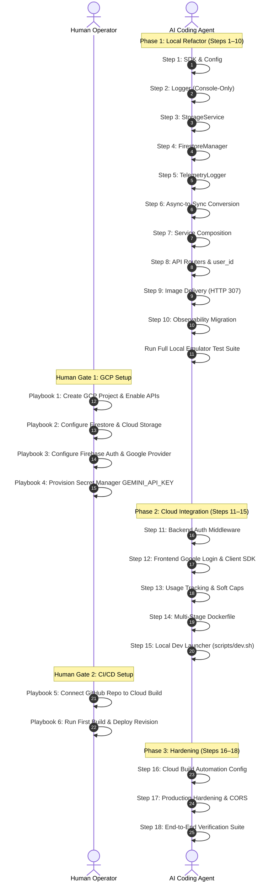

# Publishing Refactor — Specification & Implementation Blueprint

**Document Version**: 2.0 (Fortified Architecture)  
**Status**: Ready for Implementation  
**Last Updated**: 2026-09-01  
**Target Platform**: Google Cloud Run + Firebase (Firestore, Storage, Auth) in `asia-southeast1`  
**Reference Documents**: [`docs/SPEC.md`](file:///Users/zacang/Documents/datascience/image-gen-pipeline/docs/SPEC.md), [`docs/database_layer.dbml`](file:///Users/zacang/Documents/datascience/image-gen-pipeline/docs/database_layer.dbml)

---

## 1. Executive Summary & Core Decisions

This document is the definitive master specification and implementation blueprint for refactoring the **Image Gen Pipeline Studio** from a single-user local SQLite application into a production-grade, multi-user, cost-optimized cloud application hosted on GCP.

### Architectural Principles
1. **Lowest Cloud Cost Baseline ($0–$2/month infrastructure)**: Zero standing infrastructure costs. Scale-to-zero Cloud Run instances (512MB RAM / 1 vCPU), Firestore Native mode free tier (50k daily reads, 20k daily writes), and Cloud Storage standard tier.
2. **Object-Oriented Composition & Zero Circular Coupling**: Eliminate all circular dependencies (e.g. `WardrobeService` ↔ `GenerationService`). Services compose dedicated engine components (`ImageGenerator`, `StorageService`, `FirestoreManager`) via dependency injection.
3. **Synchronous Execution Model**: Replace `aiosqlite` and asynchronous coroutine sprawl with clean synchronous functions (`def`) executed across FastAPI's high-throughput threadpool worker model.
4. **Hybrid Edge Image Delivery (HTTP 307)**: In production, `/api/images/{path}` returns a lightweight HTTP 307 Temporary Redirect to GCS signed URLs, bypassing Cloud Run container memory and preventing 512MB Out-Of-Memory crashes on 4K exports. In local development, it proxies bytes from the Storage emulator.
5. **Multi-User Data Isolation with Soft Cost Controls**: All Firestore documents carry a `user_id` field. Daily API expenditures are tracked atomically in Firestore with a configurable $20/day soft threshold and frontend warning notifications.
6. **Dual-Track Operation**: Strict segregation between autonomous **Agent Automation Tasks** and the **Human Operations Playbook** for out-of-band cloud console tasks.

---

## 2. System Architecture & Component Design

### 2.1 Target Cloud Topology



---

### 2.2 OOP Service Composition Hierarchy

To prevent service sprawl and circular references, services adhere to a strict unidirectional composition DAG (Directed Acyclic Graph):



---

## 3. Product Specification Changes & SPEC.md Audit

This section maps every change directly against the existing product technical specification in [`docs/SPEC.md`](file:///Users/zacang/Documents/datascience/image-gen-pipeline/docs/SPEC.md), detailing what changes, what remains unchanged, and new specifications introduced.

### 3.1 SPEC.md Section-by-Section Change Matrix

| SPEC Section | Status | Summary of Changes |
|---|---|---|
| **§1. System Architecture** | **CHANGED** | Single-user local async architecture becomes multi-user cloud-hosted sync architecture on Cloud Run with Firebase services. Added Auth middleware, Usage tracking middleware, and GCS edge delivery. |
| **§2. Data Models & Database** | **CHANGED** | SQLite (`aiosqlite`) replaced by Cloud Firestore Native mode (7 flat collections). Multi-tenancy enabled via `user_id` on every document. JSON text fields converted to native Firestore Maps/Arrays. Lineage costs pre-computed at write time. |
| **§3. REST API Contract** | **CHANGED** | All endpoints (except public health/docs) now require `Authorization: Bearer <ID_TOKEN>`. Added `GET /api/usage`. Observability endpoints switched to Firestore backend. Added `X-Usage-Warning` response headers. |
| **§4. Prompting Architecture** | **UNCHANGED** | All Gemini Interactions API configurations (`type: text, mime_type: application/json` for text; `type: image, aspect_ratio, image_size` for images), seed-locking, chroma constancy (lossless PNG/WebP, ICC profile preservation), and 9-taxonomy categories remain 100% identical. |
| **§5. Wardrobe Auto-Segmentation** | **CHANGED** *(Storage Only)* | Segmentation logic, Gemini Vision bounding box detection, and pin grounding (①②③) logic remain identical. Garment crops are now persisted to Cloud Storage (`{user_id}/wardrobe/items/`) via `StorageService` instead of local disk. |
| **§6. Export Studio & Bundling** | **UNCHANGED** *(Storage Only)* | All 8 export presets (`01_SocialFeed` to `08_4KSquare`), PIL neural crop logic, and ZIP packaging remain identical. Source images are read from GCS, and ZIP archives are generated in-memory (`io.BytesIO`) rather than on local disk. |
| **§7. Observability & Cost Engine** | **CHANGED** | 4 JSONL files and `RotatingFileHandler` removed. Audit events write to Firestore `telemetry_events` via non-blocking background threads. App logs stream to stdout (Cloud Logging). Pricing calculation formulas in `pricing.py` remain identical. |
| **§8. Directory & Storage Layout** | **CHANGED** | Local `storage/` directory removed. Media assets structured in Cloud Storage bucket by `{user_id}/{category}/{filename}`. |

---

### 3.2 Detailed Database & Persistence Specification (SPEC §2)

1. **Engine**: SQLite and `aiosqlite` at `storage/studio.db` are completely removed. Firestore Native mode using the synchronous `google.cloud.firestore` client (via `firebase_admin.firestore`) is the single persistent storage engine.
2. **Schema & Multi-Tenancy**: All documents are stored in 7 flat collections. Every document includes `user_id: string` (Firebase UID). Full DBML schema is maintained in [`docs/database_layer.dbml`](file:///Users/zacang/Documents/datascience/image-gen-pipeline/docs/database_layer.dbml).
3. **Data Types**: All JSON string columns (`schema_json`, `bbox_json`, `drop_position_json`, `extracted_details_json`, `region_bbox_json`) are replaced by native Firestore `Map` (dictionary) and `Array` (list) types. No `json.dumps()` or `json.loads()` serialization is performed.
4. **Lineage Pre-computation**: `accumulated_cost_usd` and `accumulated_tokens` are calculated at generation time (`Parent Accumulated Cost + Current Cost`) and stored directly on the generation document. Recursive runtime parent traversal is eliminated for history queries.
5. **Relational Join Replacement**: `composition_assignments` replaces the SQL `LEFT JOIN wardrobe_items` with a Firestore batch document read (`db.get_all()`) in Python to resolve garment labels and image paths.
6. **Composite Indexes**: Compound queries are formally defined in `firestore.indexes.json`:
   - `generations`: `(user_id ASC, created_at DESC)`
   - `generations`: `(user_id ASC, is_baseline ASC, created_at DESC)`
   - `generations`: `(conversation_id ASC, created_at ASC)`
   - `wardrobe_items`: `(user_id ASC, deleted_at ASC, created_at DESC)`
   - `composition_assignments`: `(generation_id ASC, pin_number ASC)`
   - `telemetry_events`: `(user_id ASC, timestamp DESC)`
   - `telemetry_events`: `(component ASC, timestamp DESC)`
   - `usage_daily`: `(user_id ASC, date DESC)`

---

### 3.3 Telemetry & Observability Specification (SPEC §7)

1. **Storage Decommissioning**: `generation_audit.jsonl`, `vision_audit.jsonl`, `wardrobe_audit.jsonl`, `telemetry.jsonl`, and `storage/logs/studio.log` are deleted.
2. **Event Dispatching**: Audit events are dispatched to the Firestore `telemetry_events` collection via daemon fire-and-forget background threads.
3. **Application Logs**: Standard Python logging writes structured lines to `stdout`, automatically ingested by Cloud Run into Cloud Logging.
4. **Observability API Updates (SPEC §3.8)**:
   - `GET /api/telemetry/events`: Filtered compound queries against `telemetry_events` with pagination.
   - `GET /api/telemetry/events/{request_id}`: Chronological trace filtering by `request_id`.
   - `GET /api/telemetry/stats`: Server-side calculated aggregation metrics across events.
   - `GET /api/telemetry/logs`: Returns recent structured events from `telemetry_events` (replaces file tail).
   - `GET /api/telemetry/db/summary`: Returns collection names and approximate document counts.
   - `GET /api/telemetry/db/{collection_name}`: Cursor-paginated document inspector using `start_after`.

---

### 3.4 Image Storage & Edge Delivery Specification (SPEC §5, §6, §8)

1. **Bucket Hierarchy**:
   ```
   {BUCKET_NAME}/
   ├── {user_id}/
   │   ├── moodboards/
   │   │   └── mb_{id}_{index}.png
   │   ├── generations/
   │   │   ├── gen_{id}_seed{seed}.png
   │   │   ├── mask_{id}.png
   │   │   └── export_{id}_4k.png
   │   └── wardrobe/
   │       ├── sources/
   │       │   └── sheet_{id}.png
   │       └── items/
   │           ├── item_{id}_cropped.png
   │           └── item_{id}_upscaled.png
   ```
2. **Delivery Route (`GET /api/images/{path:path}`)**:
   - **Production (`ENVIRONMENT=production`)**: Generates a GCS V4 Signed URL with a 60-minute TTL and returns an `HTTP 307 Temporary Redirect` with `Cache-Control: private, max-age=3600`. The client browser downloads directly from Google Cloud Storage edge servers without consuming Cloud Run RAM.
   - **Local Dev (`ENVIRONMENT=local`)**: Streams bytes directly from the Firebase Storage emulator.

---

### 3.5 Authentication & Authorization Specification (New SPEC)

1. **Identity Provider**: Firebase Authentication with Google Sign-In provider enabled.
2. **Backend Authentication Dependency**: `app.auth.firebase_auth.get_current_user` validates the `Authorization: Bearer <ID_TOKEN>` header against Firebase Admin SDK `auth.verify_id_token()`.
3. **Public Routes (Auth Exempt)**:
   - `GET /health`
   - `GET /docs`, `GET /openapi.json`, `GET /redoc`
   - `GET /` and frontend static asset routes (`/assets/*`, `/favicon.ico`)
4. **Local Dev Dual-Mode**: In local dev mode (`ENVIRONMENT=local`), if no Authorization header is supplied, `get_current_user` returns a mock local user `{"uid": "local_dev_user", "email": "dev@local.studio", "name": "Local Developer"}` to allow offline testing.

---

### 3.6 Usage Tracking & Cost Control Specification (New SPEC)

1. **Daily Soft Cap**: $20.00 USD per user per day (default `DAILY_SPEND_CAP_USD=20.0`).
2. **Spend Ledger**: Tracked in `usage_daily/{user_id}_{YYYY-MM-DD}` using atomic Firestore `FieldValue.increment(cost_usd)`.
3. **Pre-flight & Post-flight Checks**:
   - Before model execution: Query `usage_daily` for current day spend. If spend exceeds 80% ($16.00), attach warning metadata.
   - After model execution: Increment user's daily spend ledger atomically.
4. **New Endpoint**: `GET /api/usage` returns current user's daily spend summary and budget remaining.
5. **Response Headers**: Generative endpoints append `X-Usage-Warning: <message>` and `X-Daily-Spend-USD: <amount>` headers.

---

## 4. Dual-Track Implementation Plan

The implementation is divided into two distinct tracks:
- **Track A: Autonomous Agent Execution** (18 self-contained, test-driven steps executed by the AI agent).
- **Track B: Human Operations Playbook** (Exact manual instructions for GCP console, billing, OAuth credentials, and Secrets setup).



---

## 5. Track A: Autonomous Agent Execution Blueprint

Each step below is atomic, test-driven (TDD), and must pass all verification criteria before moving to the next.

---

### Step 1: Dependencies & Firebase Initialization

#### Agent Implementation Instructions
1. Edit [`pyproject.toml`](file:///Users/zacang/Documents/datascience/image-gen-pipeline/pyproject.toml):
   - Add `"firebase-admin>=6.5.0"` and `"google-cloud-storage>=2.14.0"`.
   - Remove `"aiosqlite>=0.20.0"` and `"pytest-asyncio>=0.23.0"`.
   - Update pytest configuration to remove `asyncio_mode = "auto"`.
2. Run `uv sync` to update the lockfile and virtual environment.
3. Edit [`src/app/config.py`](file:///Users/zacang/Documents/datascience/image-gen-pipeline/src/app/config.py):
   - Add `GCP_PROJECT_ID: str = "image-gen-studio-local"`
   - Add `GCS_BUCKET: str = "image-gen-studio-local-bucket"`
   - Add `DAILY_SPEND_CAP_USD: float = 20.0`
   - Add `ENVIRONMENT: str = "local"`
   - Remove `DATABASE_URL` and SQLite folder creation logic.
4. Create [`src/app/firebase_init.py`](file:///Users/zacang/Documents/datascience/image-gen-pipeline/src/app/firebase_init.py):
   ```python
   import os
   from typing import Optional
   import firebase_admin
   from firebase_admin import credentials, firestore, storage

   _app: Optional[firebase_admin.App] = None

   def initialize_firebase(project_id: Optional[str] = None, storage_bucket: Optional[str] = None) -> firebase_admin.App:
       global _app
       if _app:
           return _app

       options = {}
       if project_id:
           options["projectId"] = project_id
       if storage_bucket:
           options["storageBucket"] = storage_bucket

       # If emulator hosts are present, initialize with project ID without requiring GCP credentials
       if os.getenv("FIRESTORE_EMULATOR_HOST") or os.getenv("FIREBASE_AUTH_EMULATOR_HOST"):
           _app = firebase_admin.initialize_app(options=options if options else None)
       else:
           # Uses Application Default Credentials (ADC) in production Cloud Run
           _app = firebase_admin.initialize_app(options=options if options else None)
       return _app

   def get_firestore_client():
       initialize_firebase()
       return firestore.client()

   def get_storage_bucket():
       initialize_firebase()
       return storage.bucket()
   ```
5. Create [`firebase.json`](file:///Users/zacang/Documents/datascience/image-gen-pipeline/firebase.json) in project root:
   ```json
   {
     "firestore": {
       "rules": "firestore.rules",
       "indexes": "firestore.indexes.json"
     },
     "emulators": {
       "firestore": { "port": 8181 },
       "auth": { "port": 9099 },
       "storage": { "port": 9199 },
       "ui": { "enabled": true, "port": 4000 }
     }
   }
   ```
6. Create [`firestore.rules`](file:///Users/zacang/Documents/datascience/image-gen-pipeline/firestore.rules) and [`firestore.indexes.json`](file:///Users/zacang/Documents/datascience/image-gen-pipeline/firestore.indexes.json).

#### TDD Verification Specs
- `TEST-1.1`: `uv run python -c "import firebase_admin; print(firebase_admin.__version__)"` outputs version `>= 6.5.0`.
- `TEST-1.2`: `uv run python -c "import aiosqlite"` raises `ModuleNotFoundError`.
- `TEST-1.3`: `from app.config import get_settings; s = get_settings(); assert s.GCP_PROJECT_ID and s.DAILY_SPEND_CAP_USD == 20.0`.
- `TEST-1.4`: Running `tests/test_config.py` passes all assertions.

---

### Step 2: Logging Refactor (Console-Only & Structured)

#### Agent Implementation Instructions
1. Edit [`src/app/utils/logger.py`](file:///Users/zacang/Documents/datascience/image-gen-pipeline/src/app/utils/logger.py):
   - Remove `RotatingFileHandler`, `LOG_DIR`, `LOG_FILE`, and `storage/logs/studio.log` file handlers.
   - Configure a single `logging.StreamHandler(sys.stdout)` with a standardized format:
     `"%(asctime)s [%(levelname)s] [%(name)s] [req:%(request_id)s] %(message)s"`
   - Retain `RequestContextFilter` to dynamically inject correlation request IDs.

#### TDD Verification Specs
- `TEST-2.1`: `from app.utils.logger import get_logger; logger = get_logger("test"); logger.info("test log")` outputs to stdout.
- `TEST-2.2`: Verify no `storage/logs/` directory or `.log` files are created on disk.
- `TEST-2.3`: Unit test `test_logger_request_id_injection` verifies `request_id` formatting.

---

### Step 3: StorageService Implementation

#### Agent Implementation Instructions
1. Create [`src/app/services/storage_service.py`](file:///Users/zacang/Documents/datascience/image-gen-pipeline/src/app/services/storage_service.py):
   ```python
   import io
   import mimetypes
   from datetime import timedelta
   from typing import Optional
   from PIL import Image
   from google.cloud.storage import Bucket
   from app.utils.logger import get_logger

   logger = get_logger("storage_service")

   class StorageService:
       """
       Unified synchronous Cloud Storage service for uploading, downloading,
       and generating signed edge delivery URLs for all studio media assets.
       """
       def __init__(self, bucket: Bucket, environment: str = "local"):
           self.bucket = bucket
           self.environment = environment

       def upload_bytes(
           self,
           user_id: str,
           category: str,
           filename: str,
           data: bytes,
           content_type: Optional[str] = None,
       ) -> str:
           clean_cat = category.strip("/")
           clean_fn = filename.lstrip("/")
           gcs_path = f"{user_id}/{clean_cat}/{clean_fn}"
           
           if not content_type:
               content_type, _ = mimetypes.guess_type(filename)
               content_type = content_type or "image/png"

           blob = self.bucket.blob(gcs_path)
           blob.upload_from_string(data, content_type=content_type)
           logger.info(f"Uploaded {len(data)} bytes to gs://{self.bucket.name}/{gcs_path} ({content_type})")
           return gcs_path

       def upload_pil_image(
           self,
           user_id: str,
           category: str,
           filename: str,
           image: Image.Image,
           format: str = "PNG",
           **kwargs,
       ) -> str:
           buf = io.BytesIO()
           image.save(buf, format=format, **kwargs)
           return self.upload_bytes(
               user_id=user_id,
               category=category,
               filename=filename,
               data=buf.getvalue(),
               content_type=f"image/{format.lower()}",
           )

       def download_bytes(self, gcs_path: str) -> bytes:
           blob = self.bucket.blob(gcs_path)
           if not blob.exists():
               raise FileNotFoundError(f"Blob gs://{self.bucket.name}/{gcs_path} does not exist.")
           return blob.download_as_bytes()

       def get_signed_download_url(self, gcs_path: str, expiration_minutes: int = 60) -> str:
           blob = self.bucket.blob(gcs_path)
           return blob.generate_signed_url(
               version="v4",
               expiration=timedelta(minutes=expiration_minutes),
               method="GET",
           )

       def delete_file(self, gcs_path: str) -> bool:
           blob = self.bucket.blob(gcs_path)
           if blob.exists():
               blob.delete()
               logger.info(f"Deleted gs://{self.bucket.name}/{gcs_path}")
               return True
           return False
   ```
2. Update [`src/app/dependencies.py`](file:///Users/zacang/Documents/datascience/image-gen-pipeline/src/app/dependencies.py) to register `get_storage_service()`.

#### TDD Verification Specs
- `TEST-3.1`: `test_storage_upload_and_download`: Upload 1KB bytes to emulator bucket, download and assert equality.
- `TEST-3.2`: `test_storage_upload_pil_image`: Save PIL Image object, download and verify image header with `Image.open()`.
- `TEST-3.3`: `test_storage_missing_blob_raises_404`: Assert `FileNotFoundError` on non-existent path.
- `TEST-3.4`: `test_storage_signed_url_generation`: Ensure URL returned starts with `https://` or emulator host.

---

### Step 4: FirestoreManager Implementation (Database Layer)

#### Agent Implementation Instructions
1. Rewrite [`src/app/db/database.py`](file:///Users/zacang/Documents/datascience/image-gen-pipeline/src/app/db/database.py) to implement `FirestoreManager`:
   - Replace all raw SQL strings, `aiosqlite` context managers, and `PRAGMA` schema migrations.
   - All methods converted to synchronous `def`.
   - Every read/write method takes `user_id: str`.
   - Collections: `moodboards`, `generations`, `conversations`, `wardrobe_items`, `composition_assignments`, `telemetry_events`, `usage_daily`.
   - Key Methods:
     - `create_moodboard(user_id: str, moodboard_id: str, image_paths: List[str]) -> Dict`
     - `add_moodboard_cost(moodboard_id: str, cost_usd: float, tokens: int) -> None`
     - `get_moodboard(moodboard_id: str) -> Optional[Dict]`
     - `create_generation(user_id: str, gen_data: Dict[str, Any]) -> Dict` (pre-computes lineage costs)
     - `get_generation(generation_id: str) -> Optional[Dict]`
     - `list_generations(user_id: str, is_baseline: Optional[bool] = None, limit: int = 100) -> List[Dict]`
     - `get_lineage(generation_id: str) -> Dict[str, Any]` (traverses parent docs)
     - `create_conversation(user_id: str, conv_id: str, baseline_gen_id: str, moodboard_id: Optional[str]) -> Dict`
     - `get_conversation(conv_id: str) -> Optional[Dict]`
     - `list_conversation_messages(conv_id: str) -> List[Dict]`
     - `create_wardrobe_item(user_id: str, item_data: Dict[str, Any]) -> Dict`
     - `update_wardrobe_item_details(item_id: str, extracted_details: Dict, cost_usd: Optional[float], tokens: Optional[int]) -> bool`
     - `update_wardrobe_item_upscale(item_id: str, upscaled_image_path: str, status: str, ...) -> bool`
     - `get_wardrobe_item(item_id: str) -> Optional[Dict]`
     - `list_wardrobe_items(user_id: str) -> List[Dict]` (filters `deleted_at == None`)
     - `delete_wardrobe_item(item_id: str) -> Optional[Dict]` (sets `deleted_at = now`)
     - `delete_all_wardrobe_items(user_id: str) -> List[Dict]` (batch soft-delete)
     - `create_composition_assignment(user_id: str, assignment_data: Dict[str, Any]) -> Dict`
     - `list_composition_assignments(generation_id: str) -> List[Dict]` (queries assignments, batch-fetches wardrobe label/path)
     - `get_tables_summary() -> Dict[str, Any]`
     - `get_table_records(collection_name: str, limit: int = 50, start_after_id: Optional[str] = None) -> Dict[str, Any]`

#### TDD Verification Specs
- `TEST-4.1`: `test_firestore_moodboard_crud`: Create, get, and increment cost on moodboard.
- `TEST-4.2`: `test_firestore_generation_lineage_precomputation`: Create parent generation with cost $0.05, create child generation with cost $0.03, assert child has `accumulated_cost_usd == 0.08`.
- `TEST-4.3`: `test_firestore_user_isolation`: Write docs for `user_A` and `user_B`, assert `list_generations(user_A)` never returns `user_B` items.
- `TEST-4.4`: `test_firestore_wardrobe_soft_delete`: Soft delete wardrobe item, verify `list_wardrobe_items` ignores it but `get_wardrobe_item` reflects `deleted_at`.
- `TEST-4.5`: `test_firestore_composition_assignment_resolution`: Verify `list_composition_assignments` joins garment labels without SQL.

---

### Step 5: TelemetryLogger Rewrite (Firestore Backend)

#### Agent Implementation Instructions
1. Rewrite [`src/app/utils/telemetry.py`](file:///Users/zacang/Documents/datascience/image-gen-pipeline/src/app/utils/telemetry.py):
   - Replace file-writing methods with asynchronous daemon thread calls to Firestore `telemetry_events` collection.
   - Implement query functions:
     - `query_audit_events(db, user_id=None, component=None, event=None, status=None, limit=100, offset=0)`
     - `get_request_lifecycle_trace(db, request_id)`
     - `get_telemetry_summary_stats(db, user_id=None)`
   - Guarantee zero disk file operations.

#### TDD Verification Specs
- `TEST-5.1`: `test_telemetry_record_event_non_blocking`: Assert `record_event()` returns within `< 2ms` while persisting record to Firestore in background.
- `TEST-5.2`: `test_telemetry_query_filtering`: Filter events by `component="generation"` and `status="success"`.
- `TEST-5.3`: `test_telemetry_request_lifecycle_trace`: Query by `request_id` and assert events return in strict chronological order.

---

### Step 6: Full Async-to-Sync Conversion

#### Agent Implementation Instructions
1. Convert all `async def` route handlers in `src/app/api/*.py` to standard `def` functions.
2. Convert all service methods in `src/app/services/*.py` to standard `def` methods.
3. Update `UploadFile` reading: replace `await file.read()` with `file.file.read()`.
4. Keep FastAPI `lifespan` and HTTP middleware async as required by the framework.

#### TDD Verification Specs
- `TEST-6.1`: `test_no_async_def_in_services_or_routers`: Static AST check verifying zero `async def` declarations across `src/app/api/` and `src/app/services/`.
- `TEST-6.2`: `test_fastapi_threadpool_execution`: Verify synchronous routes execute concurrently in FastAPI's `ThreadPoolExecutor`.

---

### Step 7: Service Layer OOP Refactoring & Circular Dependency Elimination

#### Agent Implementation Instructions
1. Refactor [`src/app/services/image_generator.py`](file:///Users/zacang/Documents/datascience/image-gen-pipeline/src/app/services/image_generator.py):
   - Convert `generate()` and `_execute_with_retry()` from async to sync using `time.sleep` for backoff.
   - Handles resolution negotiation (`1K` for Lite, `4K` for Pro/Flash).
2. Refactor [`src/app/services/wardrobe_service.py`](file:///Users/zacang/Documents/datascience/image-gen-pipeline/src/app/services/wardrobe_service.py):
   - Remove `self._generation_service`, `set_generation_service()`, and all references to `GenerationService`.
   - Take `StorageService`, `FirestoreManager`, and `ImageGenerator` in constructor.
   - Perform all lookbook crops and garment upscales directly using `ImageGenerator` and `StorageService`.
3. Refactor [`src/app/services/generation_service.py`](file:///Users/zacang/Documents/datascience/image-gen-pipeline/src/app/services/generation_service.py):
   - Injects `WardrobeService` as a clean one-way dependency for `ground_wardrobe_pins`.
   - Injects `StorageService` for all master image persistence.
4. Refactor [`src/app/services/export_service.py`](file:///Users/zacang/Documents/datascience/image-gen-pipeline/src/app/services/export_service.py):
   - Reads master image from `StorageService.download_bytes()`.
   - Assembles multi-ratio ZIP archive in-memory using `io.BytesIO`.
5. Update [`src/app/dependencies.py`](file:///Users/zacang/Documents/datascience/image-gen-pipeline/src/app/dependencies.py) with clean singletons and no circular setters.

#### TDD Verification Specs
- `TEST-7.1`: `test_wardrobe_service_standalone_upscale`: Upscale garment without initializing GenerationService.
- `TEST-7.2`: `test_generation_service_wardrobe_composition`: Execute composition using injected WardrobeService and ImageGenerator.
- `TEST-7.3`: `test_export_service_in_memory_zip`: Build 8-preset export bundle in-memory and verify ZIP integrity with `zipfile.ZipFile`.

---

### Step 8: API Routers & Multi-User ID Threading

#### Agent Implementation Instructions
1. Update all router endpoints across:
   - `src/app/api/moodboard.py`
   - `src/app/api/generation.py`
   - `src/app/api/refinement.py`
   - `src/app/api/inpaint.py`
   - `src/app/api/wardrobe.py`
   - `src/app/api/export.py`
   - `src/app/api/history.py`
2. Every endpoint injects `user: dict = Depends(get_current_user)` and passes `user["uid"]` into service and database operations.

#### TDD Verification Specs
- `TEST-8.1`: `test_router_user_id_propagation`: Call `/api/moodboard/analyze-and-baselines` and assert created documents contain authenticated UID.
- `TEST-8.2`: `test_history_router_user_filtered`: Call `/api/history` and assert results are scoped strictly to the calling user.

---

### Step 9: Edge Image Delivery & Proxy Route

#### Agent Implementation Instructions
1. Update image route in [`src/app/main.py`](file:///Users/zacang/Documents/datascience/image-gen-pipeline/src/app/main.py):
   ```python
   @app.get("/api/images/{path:path}")
   def serve_image(path: str, storage_service: StorageService = Depends(get_storage_service)):
       settings = get_settings()
       if settings.ENVIRONMENT == "production":
           # Generate 60-minute signed URL and redirect client directly to GCS edge
           signed_url = storage_service.get_signed_download_url(path, expiration_minutes=60)
           return RedirectResponse(
               url=signed_url,
               status_code=status.HTTP_307_TEMPORARY_REDIRECT,
               headers={"Cache-Control": "private, max-age=3600"},
           )
       else:
           # In local dev/emulator, proxy image bytes directly
           try:
               data = storage_service.download_bytes(path)
               content_type, _ = mimetypes.guess_type(path)
               return Response(content=data, media_type=content_type or "image/png")
           except FileNotFoundError:
               raise HTTPException(status_code=404, detail="Image not found")
   ```

#### TDD Verification Specs
- `TEST-9.1`: `test_image_serving_local_proxy`: In `ENVIRONMENT=local`, verify binary image bytes are returned with HTTP 200.
- `TEST-9.2`: `test_image_serving_production_redirect`: In `ENVIRONMENT=production`, verify HTTP 307 Redirect is returned with valid GCS target.

---

### Step 10: Observability Page & API Migration

#### Agent Implementation Instructions
1. Refactor [`src/app/api/telemetry.py`](file:///Users/zacang/Documents/datascience/image-gen-pipeline/src/app/api/telemetry.py):
   - All endpoints connect to `FirestoreManager` and `telemetry_events`.
   - Cursor-based pagination on `/api/telemetry/db/{collection_name}` via `start_after`.
2. Update [`src/frontend/src/pages/ObservabilityPage.jsx`](file:///Users/zacang/Documents/datascience/image-gen-pipeline/src/frontend/src/pages/ObservabilityPage.jsx):
   - Update Database Inspector tab to handle cursor pagination (`next_cursor`).
   - Display structured telemetry events in the logs viewer.

#### TDD Verification Specs
- `TEST-10.1`: `test_observability_api_stats`: Verify `/api/telemetry/stats` returns accurate success rate and event counts.
- `TEST-10.2`: `test_observability_db_inspector_pagination`: Verify fetching first 10 records and next 10 using cursor.

---

### Step 11: Backend Authentication Middleware

#### Agent Implementation Instructions
1. Create [`src/app/auth/firebase_auth.py`](file:///Users/zacang/Documents/datascience/image-gen-pipeline/src/app/auth/firebase_auth.py):
   ```python
   from fastapi import Request, HTTPException, status
   from firebase_admin import auth
   from app.config import get_settings

   PUBLIC_ROUTES = {"/health", "/docs", "/openapi.json", "/redoc", "/", "/telemetry", "/observability"}

   def get_current_user(request: Request) -> dict:
       settings = get_settings()
       path = request.url.path

       # Allow public routes without authentication
       if path in PUBLIC_ROUTES or path.startswith("/assets/") or path == "/favicon.ico":
           return {"uid": "public_anonymous", "email": None, "name": "Anonymous"}

       auth_header = request.headers.get("Authorization")
       
       # Local dev bypass fallback if no header provided
       if not auth_header and settings.ENVIRONMENT == "local":
           return {
               "uid": "local_dev_user",
               "email": "developer@local.studio",
               "name": "Local Developer",
           }

       if not auth_header or not auth_header.startswith("Bearer "):
           raise HTTPException(
               status_code=status.HTTP_401_UNAUTHORIZED,
               detail="Missing or malformed Authorization Bearer token header.",
           )

       token = auth_header.split("Bearer ")[1].strip()
       try:
           decoded_token = auth.verify_id_token(token)
           return {
               "uid": decoded_token["uid"],
               "email": decoded_token.get("email"),
               "name": decoded_token.get("name"),
           }
       except Exception as exc:
           raise HTTPException(
               status_code=status.HTTP_401_UNAUTHORIZED,
               detail=f"Invalid or expired Firebase Auth token: {exc}",
           )
   ```

#### TDD Verification Specs
- `TEST-11.1`: `test_auth_rejects_missing_header_in_production`: In `ENVIRONMENT=production`, request without header returns 401.
- `TEST-11.2`: `test_auth_accepts_valid_emulator_token`: Decode mock token and verify UID resolution.
- `TEST-11.3`: `test_auth_local_dev_fallback`: In `ENVIRONMENT=local`, verify fallback user identity when header is omitted.

---

### Step 12: Frontend Authentication Integration

#### Agent Implementation Instructions
1. In `src/frontend/`: install `firebase` (`npm install firebase`).
2. Create [`src/frontend/src/services/firebaseConfig.js`](file:///Users/zacang/Documents/datascience/image-gen-pipeline/src/frontend/src/services/firebaseConfig.js):
   - Initializes Firebase App using environment variables (`VITE_FIREBASE_API_KEY`, `VITE_FIREBASE_PROJECT_ID`, etc.).
   - Connects to Auth and Firestore emulators if `window.location.hostname === 'localhost'`.
   - Exports `auth` and `googleProvider`.
3. Update [`src/frontend/src/App.jsx`](file:///Users/zacang/Documents/datascience/image-gen-pipeline/src/frontend/src/App.jsx):
   - Add global auth listener `onAuthStateChanged(auth, (user) => ...)`.
   - Render modern dark-themed Login Screen when unauthenticated.
   - Display User Profile pill & Sign Out button in Studio Header.
4. Update [`src/frontend/src/services/apiClient.js`](file:///Users/zacang/Documents/datascience/image-gen-pipeline/src/frontend/src/services/apiClient.js):
   - Automatically injects `Authorization: Bearer ${token}` via `auth.currentUser.getIdToken()`.
   - Intercepts 401 errors and triggers sign-out.

#### TDD Verification Specs
- `TEST-12.1`: `test_frontend_build_succeeds`: `npm run build` inside `src/frontend/` produces valid `dist/` bundle.
- `TEST-12.2`: `test_api_client_token_injection`: Unit test verifying `apiClient` attaches Bearer token from auth state.

---

### Step 13: Usage Tracking & Soft Spend Caps

#### Agent Implementation Instructions
1. Create [`src/app/services/usage_service.py`](file:///Users/zacang/Documents/datascience/image-gen-pipeline/src/app/services/usage_service.py):
   ```python
   from datetime import datetime, timezone
   from typing import Dict, Any
   from google.cloud.firestore import Client, Increment
   from app.utils.logger import get_logger

   logger = get_logger("usage_service")

   class UsageService:
       def __init__(self, db: Client, daily_cap_usd: float = 20.0):
           self.db = db
           self.daily_cap_usd = daily_cap_usd

       def _get_today_key(self, user_id: str) -> str:
           today_str = datetime.now(timezone.utc).strftime("%Y-%m-%d")
           return f"{user_id}_{today_str}"

       def record_spend(self, user_id: str, cost_usd: float) -> None:
           if cost_usd <= 0:
               return
           doc_id = self._get_today_key(user_id)
           today_str = datetime.now(timezone.utc).strftime("%Y-%m-%d")
           doc_ref = self.db.collection("usage_daily").document(doc_id)
           doc_ref.set(
               {
                   "user_id": user_id,
                   "date": today_str,
                   "total_cost_usd": Increment(cost_usd),
                   "request_count": Increment(1),
                   "updated_at": datetime.now(timezone.utc),
               },
               merge=True,
           )
           logger.info(f"Recorded ${cost_usd:.4f} spend for user '{user_id}' on {today_str}")

       def check_usage(self, user_id: str) -> Dict[str, Any]:
           doc_id = self._get_today_key(user_id)
           doc = self.db.collection("usage_daily").document(doc_id).get()
           spent = 0.0
           if doc.exists:
               spent = float(doc.to_dict().get("total_cost_usd", 0.0))

           remaining = max(0.0, self.daily_cap_usd - spent)
           warning = spent >= (self.daily_cap_usd * 0.8)
           exceeded = spent >= self.daily_cap_usd

           return {
               "spent_usd": round(spent, 4),
               "cap_usd": self.daily_cap_usd,
               "remaining_usd": round(remaining, 4),
               "warning": warning,
               "exceeded": exceeded,
               "message": (
                   f"Daily spend warning: You have used ${spent:.2f} of your ${self.daily_cap_usd:.2f} daily limit."
                   if warning else None
               ),
           }
   ```
2. Add route `GET /api/usage` in [`src/app/api/config.py`](file:///Users/zacang/Documents/datascience/image-gen-pipeline/src/app/api/config.py).
3. Connect `record_spend()` across generation, refinement, inpaint, and wardrobe routes.

#### TDD Verification Specs
- `TEST-13.1`: `test_usage_record_and_atomic_increment`: Record multiple concurrent spends, verify total cost accumulates correctly.
- `TEST-13.2`: `test_usage_soft_cap_warning_threshold`: Spend $16.50 on $20 cap, assert `warning == True`.

---

### Step 14: Multi-Stage Production Dockerfile

#### Agent Implementation Instructions
1. Create [`Dockerfile`](file:///Users/zacang/Documents/datascience/image-gen-pipeline/Dockerfile):
   ```dockerfile
   # ==========================================
   # Stage 1: Build React Frontend SPA Bundle
   # ==========================================
   FROM node:20-slim AS frontend-builder
   WORKDIR /build/frontend
   COPY src/frontend/package*.json ./
   RUN npm ci --production=false
   COPY src/frontend/ ./
   RUN npm run build

   # ==========================================
   # Stage 2: Python Backend Runtime
   # ==========================================
   FROM python:3.12-slim
   ENV PYTHONUNBUFFERED=1 \
       PYTHONDONTWRITEBYTECODE=1 \
       PORT=8080

   WORKDIR /app

   # Install uv binary directly from official image
   COPY --from=ghcr.io/astral-sh/uv:latest /uv /bin/uv

   # Install Python dependencies
   COPY pyproject.toml uv.lock ./
   RUN uv sync --frozen --no-dev

   # Copy application source code
   COPY src/ ./src/
   COPY firestore.indexes.json firestore.rules ./

   # Copy built frontend SPA assets from Stage 1 into backend static location
   COPY --from=frontend-builder /build/frontend/dist ./src/frontend/dist

   EXPOSE 8080

   CMD ["uv", "run", "uvicorn", "app.main:app", "--host", "0.0.0.0", "--port", "8080", "--app-dir", "src", "--workers", "1"]
   ```
2. Create [`.dockerignore`](file:///Users/zacang/Documents/datascience/image-gen-pipeline/.dockerignore).

#### TDD Verification Specs
- `TEST-14.1`: `docker build -t studio-test .` builds successfully.
- `TEST-14.2`: Container starts and responds to `GET /health` with HTTP 200.

---

### Step 15: Local Development Launcher & Emulator Scripts

#### Agent Implementation Instructions
1. Create [`scripts/dev.sh`](file:///Users/zacang/Documents/datascience/image-gen-pipeline/scripts/dev.sh):
   - Starts Firebase Emulators on ports 8181 (Firestore), 9099 (Auth), 9199 (Storage), 4000 (UI).
   - Sets environment variables `FIRESTORE_EMULATOR_HOST=localhost:8181`, `FIREBASE_AUTH_EMULATOR_HOST=localhost:9099`, `FIREBASE_STORAGE_EMULATOR_HOST=localhost:9199`.
   - Starts FastAPI backend (`uv run uvicorn app.main:app --reload --port 7860 --app-dir src`).
   - Starts Vite frontend dev server (`npm run dev` in `src/frontend`).
   - Traps SIGINT/SIGTERM to cleanly kill all child processes.
2. Update [`launch.command`](file:///Users/zacang/Documents/datascience/image-gen-pipeline/launch.command) to execute `scripts/dev.sh`.

#### TDD Verification Specs
- `TEST-15.1`: Execute `scripts/dev.sh`, verify all 3 services boot up, and send SIGINT to verify zero orphan background processes.

---

### Step 16: Cloud Build CI/CD Automation

#### Agent Implementation Instructions
1. Create [`cloudbuild.yaml`](file:///Users/zacang/Documents/datascience/image-gen-pipeline/cloudbuild.yaml):
   ```yaml
   steps:
     # 1. Build Multi-Stage Docker Image
     - name: 'gcr.io/cloud-builders/docker'
       args:
         - 'build'
         - '-t'
         - '${_REGION}-docker.pkg.dev/$PROJECT_ID/${_REPO}/${_IMAGE}:$COMMIT_SHA'
         - '-t'
         - '${_REGION}-docker.pkg.dev/$PROJECT_ID/${_REPO}/${_IMAGE}:latest'
         - '.'

     # 2. Push Image to Artifact Registry
     - name: 'gcr.io/cloud-builders/docker'
       args:
         - 'push'
         - '--all-tags'
         - '${_REGION}-docker.pkg.dev/$PROJECT_ID/${_REPO}/${_IMAGE}'

     # 3. Deploy to Cloud Run
     - name: 'gcr.io/google.com/cloudsdktool/cloud-sdk'
       entrypoint: gcloud
       args:
         - 'run'
         - 'deploy'
         - '${_SERVICE}'
         - '--image=${_REGION}-docker.pkg.dev/$PROJECT_ID/${_REPO}/${_IMAGE}:$COMMIT_SHA'
         - '--region=${_REGION}'
         - '--platform=managed'
         - '--allow-unauthenticated'
         - '--memory=512Mi'
         - '--cpu=1'
         - '--min-instances=0'
         - '--max-instances=2'
         - '--timeout=300'
         - '--set-secrets=GEMINI_API_KEY=gemini-api-key:latest'
         - '--set-env-vars=GCP_PROJECT_ID=$PROJECT_ID,GCS_BUCKET=${_BUCKET},ENVIRONMENT=production,DAILY_SPEND_CAP_USD=20.0'

   substitutions:
     _REGION: asia-southeast1
     _REPO: studio-repo
     _IMAGE: image-gen-studio
     _SERVICE: image-gen-studio
     _BUCKET: image-gen-studio-prod-media

   options:
     logging: CLOUD_LOGGING_ONLY
   ```

---

### Step 17: Production Hardening, CORS & Validation

#### Agent Implementation Instructions
1. Update [`src/app/main.py`](file:///Users/zacang/Documents/datascience/image-gen-pipeline/src/app/main.py):
   - Restrict CORS origins in production to Cloud Run domain.
   - Add request payload size limits (50MB for lookbook sheets).
2. Update [`.env.example`](file:///Users/zacang/Documents/datascience/image-gen-pipeline/.env.example) with clear production and local values.

---

### Step 18: Full End-to-End Verification

#### Agent Implementation Instructions
1. Run complete automated test suite:
   `FIRESTORE_EMULATOR_HOST=localhost:8181 FIREBASE_AUTH_EMULATOR_HOST=localhost:9099 FIREBASE_STORAGE_EMULATOR_HOST=localhost:9199 uv run pytest tests/ -v`
2. Assert 100% tests passing.

---

## 6. Track B: Human Operations Playbook

This playbook outlines every manual action required from the human operator. All CLI commands are formatted for copy-pasting into your terminal.

---

### Playbook 1: GCP Project Initialization & Service APIs

```bash
# 1. Set your custom GCP Project ID
export PROJECT_ID="your-image-studio-project"
export REGION="asia-southeast1"

# 2. Create GCP project (or set existing)
gcloud projects create $PROJECT_ID --name="Image Gen Studio"
gcloud config set project $PROJECT_ID

# 3. Link your Billing Account (replace ACCOUNT_ID with your billing account ID)
# Find your billing ID via: gcloud billing accounts list
gcloud billing projects link $PROJECT_ID --billing-account=YOUR_BILLING_ACCOUNT_ID

# 4. Enable required GCP Service APIs
gcloud services enable \
  run.googleapis.com \
  cloudbuild.googleapis.com \
  artifactregistry.googleapis.com \
  firestore.googleapis.com \
  secretmanager.googleapis.com \
  storage.googleapis.com \
  identitytoolkit.googleapis.com
```

---

### Playbook 2: Cloud Firestore & Cloud Storage Provisioning

```bash
# 1. Create Firestore in Native Mode (Singapore region)
gcloud firestore databases create --location=$REGION --type=firestore-native

# 2. Create Storage Bucket for Studio media
export BUCKET_NAME="${PROJECT_ID}-media"
gcloud storage buckets create gs://$BUCKET_NAME \
  --location=$REGION \
  --default-storage-class=STANDARD \
  --uniform-bucket-level-access

# 3. Deploy Firestore Indexes & Security Rules
# Ensure Firebase CLI is logged in: firebase login
firebase use $PROJECT_ID
firebase deploy --only firestore:indexes,firestore:rules
```

---

### Playbook 3: Firebase Authentication & Google OAuth Setup

> [!IMPORTANT]
> **Human Action in Firebase Console**:
> 1. Open [Firebase Console](https://console.firebase.google.com/) and click **Add Project** -> Select `$PROJECT_ID`.
> 2. Navigate to **Build** -> **Authentication** -> Click **Get Started**.
> 3. Under **Sign-in method**, select **Google** -> Click **Enable**.
> 4. Fill in project public-facing name (`Image Gen Studio`) and support email -> Click **Save**.
> 5. Navigate to **Project Settings** (gear icon) -> Under **Your apps**, click the **Web icon (`</>`)**.
> 6. Register app name `studio-web` and copy the `firebaseConfig` object values into your local `src/frontend/.env.production`:
>    ```bash
>    VITE_FIREBASE_API_KEY="AIzaSy..."
>    VITE_FIREBASE_AUTH_DOMAIN="your-project.firebaseapp.com"
>    VITE_FIREBASE_PROJECT_ID="your-project"
>    VITE_FIREBASE_STORAGE_BUCKET="your-project-media"
>    ```

---

### Playbook 4: Secret Manager (Gemini API Key) Provisioning

```bash
# 1. Store your Google AI Studio / Gemini API key securely in Secret Manager
echo -n "YOUR_GEMINI_API_KEY_HERE" | \
  gcloud secrets create gemini-api-key \
  --data-file=- \
  --replication-policy=automatic

# 2. Grant Cloud Run Service Account permission to read the secret
export PROJECT_NUMBER=$(gcloud projects describe $PROJECT_ID --format="value(projectNumber)")
gcloud secrets add-iam-policy-binding gemini-api-key \
  --member="serviceAccount:${PROJECT_NUMBER}-compute@developer.gserviceaccount.com" \
  --role="roles/secretmanager.secretAccessor"
```

---

### Playbook 5: Artifact Registry & Cloud Build CI/CD Connection

```bash
# 1. Create Docker repository in Artifact Registry
gcloud artifacts repositories create studio-repo \
  --repository-format=docker \
  --location=$REGION \
  --description="Image Gen Studio container images"

# 2. Grant Cloud Build permission to deploy to Cloud Run & Service Account User
gcloud projects add-iam-policy-binding $PROJECT_ID \
  --member="serviceAccount:${PROJECT_NUMBER}@cloudbuild.gserviceaccount.com" \
  --role="roles/run.admin"

gcloud iam service-accounts add-iam-policy-binding \
  ${PROJECT_NUMBER}-compute@developer.gserviceaccount.com \
  --member="serviceAccount:${PROJECT_NUMBER}@cloudbuild.gserviceaccount.com" \
  --role="roles/iam.serviceAccountUser"
```

> [!IMPORTANT]
> **Human Action in Cloud Build Console**:
> 1. Open [Cloud Build Triggers Console](https://console.cloud.google.com/cloud-build/triggers).
> 2. Click **Connect Repository** -> Select **GitHub** -> Authenticate and choose your repository `image-gen-pipeline`.
> 3. Click **Create Trigger**:
>    - Name: `deploy-main-branch`
>    - Event: `Push to a branch`
>    - Branch regex: `^main$`
>    - Configuration: `Cloud Build configuration file (yaml)` -> Location: `/cloudbuild.yaml`
>    - Substitution Variables:
>      - `_BUCKET` = `your-image-studio-project-media`
> 4. Click **Create**. Every `git push origin main` will now automatically test, build, and deploy to Cloud Run!

---

### Playbook 6: Initial Manual Deployment & Verification

```bash
# Submit initial build manually via Cloud Build to verify the pipeline
gcloud builds submit --config=cloudbuild.yaml \
  --substitutions=_BUCKET="${PROJECT_ID}-media"

# Get public Cloud Run service URL
gcloud run services describe image-gen-studio \
  --region=$REGION \
  --format="value(status.url)"
```

---

## 7. Comprehensive Test Plan Matrix

| Step | Test File | Target Functionality | Verification Mechanism |
|---|---|---|---|
| **Step 1** | `tests/test_config.py` | Pydantic configuration defaults & env overrides | Sync unit tests |
| **Step 2** | `tests/test_logger.py` | Stdout JSON lines & request ID injection | Stream capture |
| **Step 3** | `tests/test_storage_service.py` | Upload, download, PIL image conversion & GCS signed URLs | Storage Emulator |
| **Step 4** | `tests/test_db.py` | CRUD operations across 7 Firestore collections & lineage costs | Firestore Emulator |
| **Step 5** | `tests/test_telemetry.py` | Non-blocking thread event dispatch & trace resolution | Firestore Emulator |
| **Step 6** | `tests/test_sync_architecture.py` | Zero coroutines in service & API handler layers | Python AST inspection |
| **Step 7** | `tests/test_service_composition.py` | ImageGenerator, WardrobeService, GenerationService integration | Emulator suite |
| **Step 8** | `tests/test_api_endpoints.py` | All REST endpoints with multi-user isolation | FastAPI TestClient |
| **Step 9** | `tests/test_image_delivery.py` | Local bytes proxy vs Production HTTP 307 Signed Redirect | TestClient |
| **Step 10** | `tests/test_observability.py` | Observability stats and cursor-based DB inspection | TestClient |
| **Step 11** | `tests/test_auth.py` | Bearer token verification, invalid token 401 & dev fallback | TestClient |
| **Step 12** | `src/frontend/` | Frontend SPA Vite build & token injection | `npm run build` |
| **Step 13** | `tests/test_usage_service.py` | Daily $20 spend cap tracking & atomic increments | Firestore Emulator |
| **Step 14** | `Dockerfile` | Multi-stage container build and health check probe | Docker engine |
| **Step 15** | `scripts/dev.sh` | Local dev bootstrapper and clean process shutdown | Shell subshell |
| **Step 16** | `cloudbuild.yaml` | Cloud Build CI/CD syntax and substitutions validation | `gcloud builds` |
| **Step 17** | `tests/test_security_headers.py` | Production CORS restriction & payload size limits | TestClient |
| **Step 18** | Full Suite | End-to-end regression validation | `pytest tests/` |
